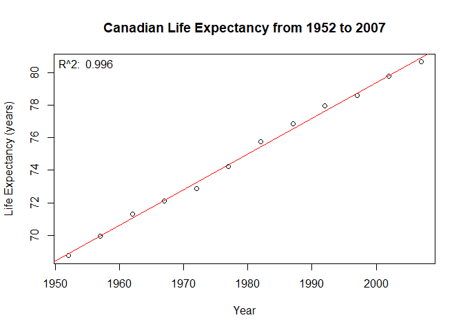

hw01\_gapminder
================
Avril Metcalfe-Roach
10 September 2019

## Formatting the preliminary dataset

``` r
raw_data <- gapminder %>% 
  as_tibble()
```

## Plotting Canadian life expectancy from 1952 to 2007

### Isolate Country, Life Exp, and Year columns

``` r
col_data <- raw_data %>% 
  select(country,year,lifeExp)
```

### Isolate Canadian data only

``` r
refined_data <- col_data %>% 
  filter(country=="Canada")
```

### Create scatterplot

``` r
attach(refined_data) # Defines dataset as current object
plot(year, lifeExp, main="Canadian Life Expectancy from 1952 to 2007", xlab="Year",ylab="Life Expectancy (years)", pch=20, xlim=NULL,ylim=c(68,82))

# Add line of best fit:
fit <- lm(lifeExp~year)
abline(fit, col="red")

# Add R squared value to plot:
rsq <- summary(fit)$adj.r.squared %>% 
  format(digits=3) %>% 
  as.character()
rsq_label <- paste("R^2: ",rsq)
plotrix::corner.label(rsq_label)
```

<!-- -->

    ## $x
    ## [1] 1949.8
    ## 
    ## $y
    ## [1] 82.56
