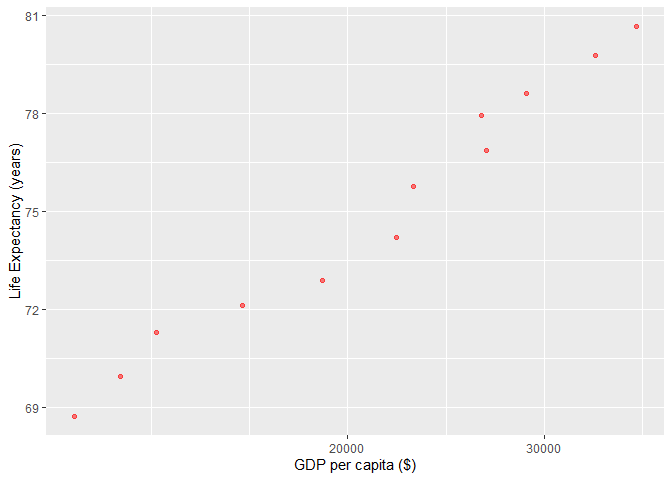
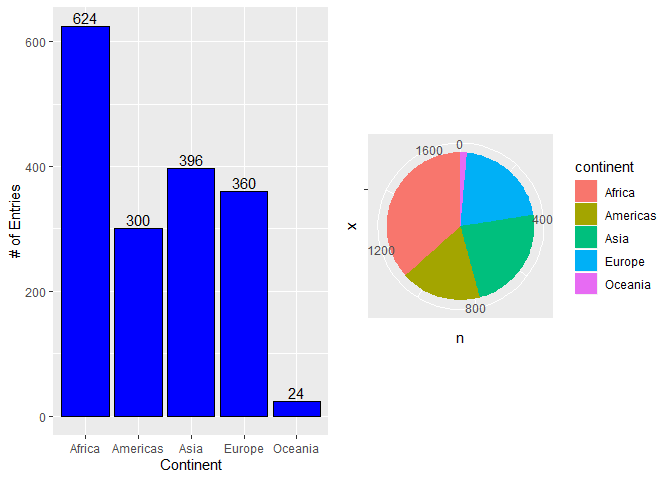
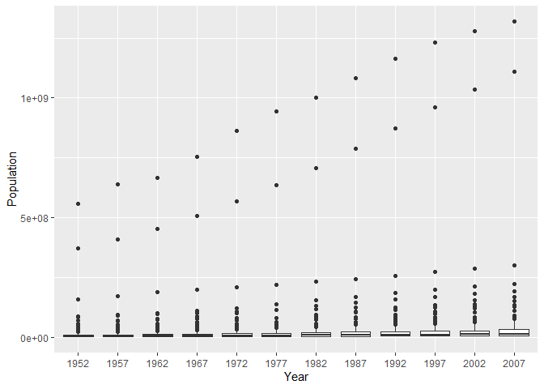
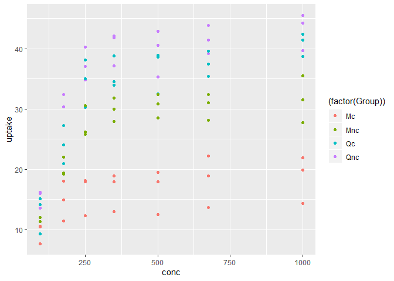
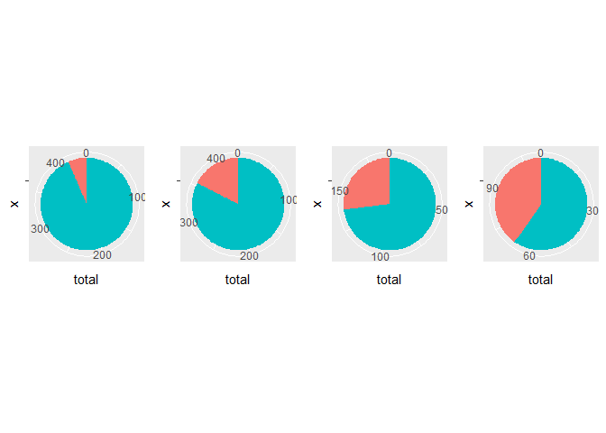

hw02\_gap\_dplyr
================
Avril Metcalfe-Roach
18 September 2019

# Exercise 1: Dplyr package

## Data Initialization

``` r
raw_data <- gapminder %>% 
  as_tibble()
```

## 1.1 - Subset gapminder to 3 countries, 1970s.

### Countries: Canada, India, Italy

``` r
filtered <- raw_data %>% 
  filter(country %in% c("Canada","India","Italy"), 
         year %in% c(1970:1979))
```

## 1.2 - Select country, gdpPercap using %\>%

``` r
country_gdp <- filtered %>% 
  select(country,gdpPercap)
country_gdp
```

    ## # A tibble: 6 x 2
    ##   country gdpPercap
    ##   <fct>       <dbl>
    ## 1 Canada     18971.
    ## 2 Canada     22091.
    ## 3 India        724.
    ## 4 India        813.
    ## 5 Italy      12269.
    ## 6 Italy      14256.

## 1.3 - Countries with drops in life expectancy

``` r
exp_list <- gapminder$lifeExp
change <- diff(exp_list,lag=1,differences=1)
# Add NA value to beginning of change vector:
change_2 <- append(change,NA,after=0)
# Create new tibble with delta life expectancy as a column:
gapminder_lifeExp <- gapminder
gapminder_lifeExp$delta <- change_2

# NOTE: INCLUDES APPARENT REDUCTIONS IN LIFE EXP DUE TO SWITCHING COUNTRIES!!!
gapminder_redExp <- gapminder_lifeExp %>% 
  filter(delta < 0)
```

## 1.4 - Gapminder: max GDP per capita per country

*Original question (using group\_by())*

``` r
# Create new column that lists the max GDP per country
gap_max_gdp <- gapminder %>% 
  group_by(country) %>% 
  mutate(max_gdp = max(gdpPercap)) %>% 
  ungroup()

# Filters gapminder to only show max GDP; removes the redundant 'max GDP' column
max_per_country <- gap_max_gdp %>% 
  filter(gdpPercap == max_gdp) %>% 
  subset(select = -max_gdp)
```

## 1.5 - Canadian Life Expectancy vs GDP

``` r
# Select data
canadians <- gapminder %>% 
  filter(country=="Canada") %>% 
  select(lifeExp,gdpPercap)

# Plot in ggplot
ggplot(canadians, aes(gdpPercap,lifeExp)) +
  geom_point(alpha=0.5, colour = "red") +
  scale_x_log10("GDP per capita ($)") +
  ylab("Life Expectancy (years)")
```

<!-- -->

# Exercise 2: Explore individual variables with dplyr

## Categorical variable: continent

### Possible range of continent

  - Assuming we’re not creating any new continents, this variable is
    inherently limited to the seven continents.
      - *Note*: North & South America are grouped into ‘Americas’
  - Possibilities: c(**Asia, Americas, Europe, Africa, Oceania**,
    Antarctica)
      - *Note*: Antarctica has no entries in gapminder, as it is a
        research base.

### Spread of values

Box and Whisker summary of data:

``` r
con_only <- raw_data %>% #gapminder as tibble
  select(continent)
con_sum <- count(con_only, continent) %>%  # dplyr: table of counts per continent
  as_tibble()
print(summary(con_sum))
```

    ##     continent       n        
    ##  Africa  :1   Min.   : 24.0  
    ##  Americas:1   1st Qu.:300.0  
    ##  Asia    :1   Median :360.0  
    ##  Europe  :1   Mean   :340.8  
    ##  Oceania :1   3rd Qu.:396.0  
    ##               Max.   :624.0

``` r
boxplot(con_sum$n, 
        ylab="Number of data entries",
        xlab = "Continents")
```

<!-- -->

The number of datapoints for each populated continent (e.g. Antarctica
not included) **ranged from 24 to 624**. The **mean and median were 341
and 360** respectively, with 50% of the data falling between 300 and 396
entries.

Visual representation of distribution:

``` r
bar_plot <- ggplot(con_sum, aes(continent,n)) +
  geom_col(colour="black",fill="blue") +
  geom_text(aes(label=n), vjust=-0.25) +
  ylab("# of Entries") +
  xlab("Continent")

pie_plot <- ggplot(con_sum, aes(x='',y=n,fill=continent)) +
  geom_bar(width=1, stat = "identity") +
  coord_polar(theta="y")

require(gridExtra)
```

    ## Loading required package: gridExtra

    ## 
    ## Attaching package: 'gridExtra'

    ## The following object is masked from 'package:dplyr':
    ## 
    ##     combine

``` r
gridExtra::grid.arrange(bar_plot,pie_plot,ncol=2)
```

<!-- -->

Generally, Oceania is very underrepresented, comprising just 24 out of
1704 entries. Conversely, African data was included at twice the rate of
the average at 624 entries. The other three continents are relatively
evenly represented.

## Quantitative variable: pop (population)

### Range of pop

The value of pop must be a Natural (\>0) number. No strict upper limit
is specified, but should logically be approximately 1.4 billion (the
population of China).

``` r
pop_only <- raw_data %>% # gapminder as tibble
  select(pop)
print(summary(pop_only))
```

    ##       pop           
    ##  Min.   :6.001e+04  
    ##  1st Qu.:2.794e+06  
    ##  Median :7.024e+06  
    ##  Mean   :2.960e+07  
    ##  3rd Qu.:1.959e+07  
    ##  Max.   :1.319e+09

``` r
boxplot(pop_only$pop, 
        ylab="Population",
        xlab = "")
```

<!-- -->

As demonstrated by the boxplot, the vast majority of the data (all data
within the whiskers/confidence interval) comprise a tiny fraction of the
possible range of population values. 50% of the data decribes a
population between 2.8-19.6 million, with the median population being 7
million. The average is much higher at 29.6 million as the
high-population outliers are skewing the data. The minimum and maximum
populations are 60 000 and 1.32 billion respectively.

There are 12 entries for each country, as they were sampled at every
time point. We can divide the data by year to see how the average
populations change over time:

``` r
# Linear Plot
pop_time <- raw_data %>% # raw_data is gapminder in tibble format 
  select(year, pop)
pop_time$year <- as.factor(pop_time$year)
pop_time_plot <- ggplot(pop_time, aes(year, pop)) +
  geom_boxplot() +
  xlab("Year") +
  ylab("Population") +
  ggtitle("Linear")

# Log Transformed
log_plot <- pop_time_plot + 
  scale_y_log10() +
  ggtitle("Logarithmic")

# Side by Side Output
require(gridExtra)
gridExtra::grid.arrange(pop_time_plot,log_plot,nrow=2)
```

<!-- -->

The above graph makes it easier to see that there are only a couple of
countries that have populations significantly outside of the statistical
range. In the linear plot, the significant population size and fast
growth of China and India in particular make the population growth of
the rest of the world less apparent. By transforming the y axis to a log
10 scale, all of the outliers can be captured and the general trends
become apparent: the IQR (middle 50%) of the data moves up the y axis,
showing exponential population growth.

# Exercise 3: Plot Exploration

## Scatterplot of \[CO2\]ambient vs \[CO2\]uptake

Dataset: **CO2 - *Carbon Dioxide Uptake in Grass Plants*** Here are the
main parameters of the CO2 dataset:

``` r
summary(CO2)
```

    ##      Plant             Type         Treatment       conc     
    ##  Qn1    : 7   Quebec     :42   nonchilled:42   Min.   :  95  
    ##  Qn2    : 7   Mississippi:42   chilled   :42   1st Qu.: 175  
    ##  Qn3    : 7                                    Median : 350  
    ##  Qc1    : 7                                    Mean   : 435  
    ##  Qc3    : 7                                    3rd Qu.: 675  
    ##  Qc2    : 7                                    Max.   :1000  
    ##  (Other):42                                                  
    ##      uptake     
    ##  Min.   : 7.70  
    ##  1st Qu.:17.90  
    ##  Median :28.30  
    ##  Mean   :27.21  
    ##  3rd Qu.:37.12  
    ##  Max.   :45.50  
    ## 

Plant is the type of plant, Type is the location of the plant, conc is
the ambient CO2 concentration, and uptake is the CO2 absorbed by the
plant.

``` r
scatter <- CO2 %>% 
  mutate(Group = (if_else
                  (Type=="Quebec",
                    if_else
                    (Treatment=="nonchilled","Qnc","Qc"),
                     if_else(Treatment=="nonchilled","Mnc","Mc"))))
ggplot(scatter, aes(conc,uptake)) +
  geom_point(aes(colour=(factor(Group))))
```

<!-- -->

The above graph shows the change in CO2 uptake as a function of CO2
ambient concentration. In the legend, M/Q denote location (Mississippi
vs Quebec) and c/nc denote treatment (chilled/not chilled).

From the plot, it can be seen that Quebec plants are more efficient at
carbon fixation than Mississippi plants, and chilling the plants reduces
their efficiency.

## Graph \#2

Dataset: **esoph - *Smoking, Alcohol and (O)esophageal Cancer*** Here
are the main parameters of the CO2 dataset:

``` r
esoph_cancer <- esoph %>% 
  rename("Alcohol Intake"=alcgp) %>% 
  rename("Tobacco Intake"=tobgp)
summary(esoph_cancer)
```

    ##    agegp      Alcohol Intake  Tobacco Intake     ncases      
    ##  25-34:15   0-39g/day:23     0-9g/day:24     Min.   : 0.000  
    ##  35-44:15   40-79    :23     10-19   :24     1st Qu.: 0.000  
    ##  45-54:16   80-119   :21     20-29   :20     Median : 1.000  
    ##  55-64:16   120+     :21     30+     :20     Mean   : 2.273  
    ##  65-74:15                                    3rd Qu.: 4.000  
    ##  75+  :11                                    Max.   :17.000  
    ##    ncontrols    
    ##  Min.   : 1.00  
    ##  1st Qu.: 3.00  
    ##  Median : 6.00  
    ##  Mean   :11.08  
    ##  3rd Qu.:14.00  
    ##  Max.   :60.00

*Note: Ncases and ncontrols are not relevant here, as they supply
weightings to the alcohol and tobacco groups.*

We will be looking at the relationship between alcohol consumption and
cancer rates over time.

``` r
p<-esoph_cancer %>% 
  select(-`Tobacco Intake`)
p2 <- aggregate(cbind(p$ncases,p$ncontrols),
                by=list(esoph_cancer$agegp, esoph_cancer$`Alcohol Intake`), 
                FUN=sum)

esoph_format <- function(alcohol){
  p2 %>% 
    mutate(`Cancer Rate` = (V1/(V1+V2)*100)) %>% 
    select(Group.1,Group.2,`Cancer Rate`) %>% 
    filter(Group.2 == alcohol) %>% 
    return()
}

esoph_39 <- esoph_format("0-39g/day")
esoph_79 <- esoph_format("40-79")
esoph_119 <- esoph_format("80-119")
esoph_120 <- esoph_format("120+")

esoph_pie <- function(df){
  p3 <- ggplot(df, aes(x='',y='',fill=`Cancer Rate`)) +
      geom_bar(width=1,stat="identity") +
      coord_polar(theta="y")
      return(p3)
}
esoph_pie(esoph_120)
```

<!-- -->
