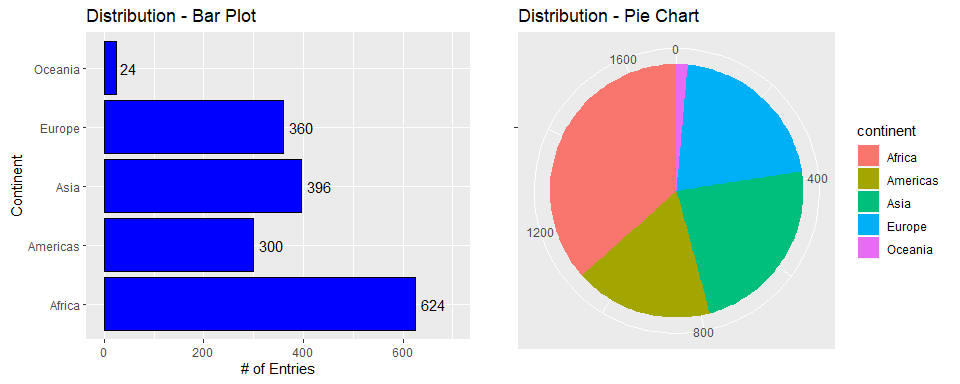
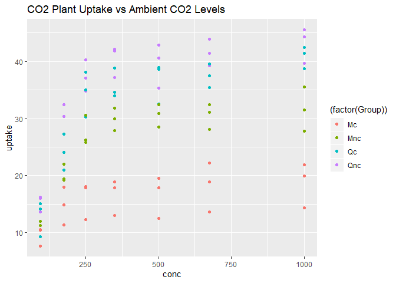

# **Exercise 1: Dplyr package**

## 1.1 - Subset gapminder to 3 countries, 1970s.
### Countries: Canada, India, Italy

```r
filtered <- gapminder %>% 
  filter(country %in% c("Canada","India","Italy"), 
         year %in% c(1970:1979))
knitr::kable(filtered, format="markdown")
```


|country |continent | year| lifeExp|       pop|  gdpPercap|
|:-------|:---------|----:|-------:|---------:|----------:|
|Canada  |Americas  | 1972|  72.880|  22284500| 18970.5709|
|Canada  |Americas  | 1977|  74.210|  23796400| 22090.8831|
|India   |Asia      | 1972|  50.651| 567000000|   724.0325|
|India   |Asia      | 1977|  54.208| 634000000|   813.3373|
|Italy   |Europe    | 1972|  72.190|  54365564| 12269.2738|
|Italy   |Europe    | 1977|  73.480|  56059245| 14255.9847|

## 1.2 - Select country, gdpPercap using %>%

```r
country_gdp <- filtered %>% 
  select(country,gdpPercap)
knitr::kable(country_gdp, format="markdown")
```


|country |  gdpPercap|
|:-------|----------:|
|Canada  | 18970.5709|
|Canada  | 22090.8831|
|India   |   724.0325|
|India   |   813.3373|
|Italy   | 12269.2738|
|Italy   | 14255.9847|

## 1.3 - Entries with a negative change in life expectancy from previous line

```r
exp_list <- gapminder$lifeExp
change <- diff(exp_list,lag=1,differences=1)
# Add NA value to beginning of change vector:
change_2 <- append(change,NA,after=0)
# Create new tibble with delta life expectancy as a column:
gapminder_lifeExp <- gapminder
gapminder_lifeExp$delta <- change_2
# Filter for ALL negative changes
gapminder_redExp <- gapminder_lifeExp %>% 
  filter(delta < 0)

DT::datatable(gapminder_redExp)
```

<!--html_preserve--><div id="htmlwidget-c7454756ac76257f360e" style="width:100%;height:auto;" class="datatables html-widget"></div>
<script type="application/json" data-for="htmlwidget-c7454756ac76257f360e">{"x":{"filter":"none","data":[["1","2","3","4","5","6","7","8","9","10","11","12","13","14","15","16","17","18","19","20","21","22","23","24","25","26","27","28","29","30","31","32","33","34","35","36","37","38","39","40","41","42","43","44","45","46","47","48","49","50","51","52","53","54","55","56","57","58","59","60","61","62","63","64","65","66","67","68","69","70","71","72","73","74","75","76","77","78","79","80","81","82","83","84","85","86","87","88","89","90","91","92","93","94","95","96","97","98","99","100","101","102","103","104","105","106","107","108","109","110","111","112","113","114","115","116","117","118","119","120","121","122","123","124","125","126","127","128","129","130","131","132","133","134","135","136","137","138","139","140","141","142","143","144","145","146","147","148","149","150","151","152","153","154","155","156","157","158","159","160","161","162","163","164","165","166","167","168","169","170","171","172","173","174","175","176","177","178","179","180","181","182","183","184","185","186","187","188","189","190","191","192","193","194","195","196","197","198","199","200","201","202","203","204","205","206","207","208","209","210","211","212","213","214","215","216","217","218","219","220","221"],["Albania","Algeria","Angola","Angola","Australia","Austria","Bahrain","Bangladesh","Benin","Benin","Bolivia","Bosnia and Herzegovina","Botswana","Botswana","Botswana","Botswana","Bulgaria","Bulgaria","Bulgaria","Bulgaria","Burkina Faso","Burundi","Burundi","Cambodia","Cambodia","Cambodia","Cameroon","Cameroon","Cameroon","Cameroon","Central African Republic","Central African Republic","Central African Republic","Central African Republic","Chad","Chad","Chad","China","China","Colombia","Comoros","Congo, Dem. Rep.","Congo, Dem. Rep.","Congo, Dem. Rep.","Congo, Dem. Rep.","Congo, Dem. Rep.","Congo, Rep.","Congo, Rep.","Congo, Rep.","Cote d'Ivoire","Cote d'Ivoire","Cote d'Ivoire","Cote d'Ivoire","Croatia","Cuba","Czech Republic","Czech Republic","Denmark","Denmark","Djibouti","Dominican Republic","Ecuador","Egypt","El Salvador","El Salvador","El Salvador","Equatorial Guinea","Eritrea","Eritrea","Ethiopia","France","Gabon","Gabon","Gabon","Gabon","Gambia","Ghana","Ghana","Guatemala","Guinea","Guinea-Bissau","Haiti","Honduras","Hong Kong, China","Hungary","Hungary","Hungary","Iceland","India","Indonesia","Iran","Iraq","Iraq","Iraq","Iraq","Israel","Italy","Jamaica","Jamaica","Jamaica","Japan","Jordan","Kenya","Kenya","Kenya","Kenya","Korea, Dem. Rep.","Korea, Dem. Rep.","Korea, Dem. Rep.","Korea, Dem. Rep.","Korea, Rep.","Kuwait","Lebanon","Lesotho","Lesotho","Lesotho","Lesotho","Liberia","Liberia","Libya","Madagascar","Malawi","Malawi","Malawi","Mali","Mauritania","Mauritius","Mexico","Mongolia","Montenegro","Montenegro","Morocco","Mozambique","Mozambique","Mozambique","Myanmar","Myanmar","Namibia","Namibia","Namibia","Nepal","Netherlands","New Zealand","Nicaragua","Niger","Nigeria","Nigeria","Nigeria","Norway","Oman","Pakistan","Panama","Paraguay","Peru","Philippines","Poland","Poland","Poland","Portugal","Puerto Rico","Puerto Rico","Reunion","Romania","Romania","Romania","Rwanda","Rwanda","Rwanda","Saudi Arabia","Senegal","Serbia","Serbia","Sierra Leone","Sierra Leone","Slovak Republic","Slovak Republic","Slovenia","Somalia","Somalia","South Africa","South Africa","South Africa","South Africa","Sri Lanka","Sudan","Swaziland","Swaziland","Swaziland","Swaziland","Switzerland","Syria","Taiwan","Tanzania","Tanzania","Tanzania","Thailand","Togo","Togo","Trinidad and Tobago","Trinidad and Tobago","Tunisia","Turkey","Uganda","Uganda","Uganda","Uganda","Uganda","United States","Uruguay","Venezuela","Vietnam","West Bank and Gaza","Yemen, Rep.","Zambia","Zambia","Zambia","Zambia","Zambia","Zimbabwe","Zimbabwe","Zimbabwe"],["Europe","Africa","Africa","Africa","Oceania","Europe","Asia","Asia","Africa","Africa","Americas","Europe","Africa","Africa","Africa","Africa","Europe","Europe","Europe","Europe","Africa","Africa","Africa","Asia","Asia","Asia","Africa","Africa","Africa","Africa","Africa","Africa","Africa","Africa","Africa","Africa","Africa","Asia","Asia","Americas","Africa","Africa","Africa","Africa","Africa","Africa","Africa","Africa","Africa","Africa","Africa","Africa","Africa","Europe","Americas","Europe","Europe","Europe","Europe","Africa","Americas","Americas","Africa","Americas","Americas","Americas","Africa","Africa","Africa","Africa","Europe","Africa","Africa","Africa","Africa","Africa","Africa","Africa","Americas","Africa","Africa","Americas","Americas","Asia","Europe","Europe","Europe","Europe","Asia","Asia","Asia","Asia","Asia","Asia","Asia","Asia","Europe","Americas","Americas","Americas","Asia","Asia","Africa","Africa","Africa","Africa","Asia","Asia","Asia","Asia","Asia","Asia","Asia","Africa","Africa","Africa","Africa","Africa","Africa","Africa","Africa","Africa","Africa","Africa","Africa","Africa","Africa","Americas","Asia","Europe","Europe","Africa","Africa","Africa","Africa","Asia","Asia","Africa","Africa","Africa","Asia","Europe","Oceania","Americas","Africa","Africa","Africa","Africa","Europe","Asia","Asia","Americas","Americas","Americas","Asia","Europe","Europe","Europe","Europe","Americas","Americas","Africa","Europe","Europe","Europe","Africa","Africa","Africa","Asia","Africa","Europe","Europe","Africa","Africa","Europe","Europe","Europe","Africa","Africa","Africa","Africa","Africa","Africa","Asia","Africa","Africa","Africa","Africa","Africa","Europe","Asia","Asia","Africa","Africa","Africa","Asia","Africa","Africa","Americas","Americas","Africa","Europe","Africa","Africa","Africa","Africa","Africa","Americas","Americas","Americas","Asia","Asia","Asia","Africa","Africa","Africa","Africa","Africa","Africa","Africa","Africa"],[1992,1952,1952,1987,1952,1952,1952,1952,1952,2002,1952,1952,1952,1992,1997,2002,1952,1977,1992,1997,1952,1952,1992,1952,1972,1977,1952,1992,1997,2002,1952,1992,1997,2002,1952,1997,2002,1952,1962,1952,1952,1952,1982,1987,1992,1997,1952,1992,1997,1952,1992,1997,2002,1982,1952,1952,1972,1952,1982,1952,1952,1952,1952,1952,1977,1982,1952,1952,1982,1952,1952,1952,1997,2002,2007,1952,1952,2002,1952,1952,1952,1952,1952,1952,1952,1982,1992,1952,1952,1952,1952,1952,1992,1997,2002,1952,1952,1952,1992,2002,1952,1952,1952,1992,1997,2002,1952,1992,1997,2002,1952,1952,1952,1952,1997,2002,2007,1952,1992,1952,1952,1952,1997,2002,1952,1952,1952,1952,1952,1952,2002,1952,1952,2002,2007,1952,2002,1952,1997,2002,1952,1972,1952,1952,1952,1952,1997,2002,1987,1952,1952,1952,1952,1952,1952,1952,1977,1987,1952,1952,1992,1952,1952,1987,1992,1952,1987,1992,1952,1952,1952,1982,1952,1992,1952,1972,1952,1952,1992,1952,1997,2002,2007,1952,1952,1952,1997,2002,2007,1952,1952,1952,1952,1992,1997,1952,1952,2002,1997,2002,1952,1952,1952,1977,1982,1992,1997,1952,1952,1952,1952,1952,1952,1952,1987,1992,1997,2002,1992,1997,2002],[71.581,43.077,30.015,39.906,69.12,66.8,50.939,37.484,38.223,54.406,40.414,53.82,47.622,62.745,52.556,46.634,59.6,70.81,71.19,70.32,31.975,39.031,44.736,39.417,40.317,31.22,38.523,54.314,52.199,49.856,35.463,49.396,46.066,43.308,38.092,51.573,50.525,44,44.50136,50.643,40.715,39.143,47.784,47.412,45.548,42.587,42.111,56.433,52.962,40.477,52.044,47.991,46.832,70.46,59.421,66.87,70.29,70.78,74.63,34.812,45.928,48.357,41.893,45.262,56.696,56.604,34.482,35.928,43.89,34.078,67.41,37.003,60.461,56.761,56.735,30,43.149,58.453,42.023,33.609,32.5,37.579,41.912,60.96,64.03,69.39,69.17,72.49,37.373,37.468,44.869,45.32,59.461,58.811,57.046,65.39,65.94,58.53,71.766,72.047,63.03,43.158,42.27,59.285,54.407,50.992,50.056,69.978,67.727,66.662,47.453,55.565,55.928,42.138,55.558,44.593,42.592,38.48,40.802,42.723,36.681,36.256,47.495,45.009,33.685,40.543,50.986,50.789,42.244,59.164,73.981,42.873,31.286,44.026,42.082,36.319,59.908,41.725,58.909,51.479,36.157,73.75,69.39,42.314,37.444,36.324,47.464,46.608,75.89,37.578,43.436,55.191,62.649,43.902,47.752,61.31,70.67,70.98,59.82,64.28,73.911,52.724,61.05,69.53,69.36,40,44.02,23.599,39.875,37.278,57.996,70.162,30.331,38.333,64.36,70.35,65.57,32.978,39.658,45.009,60.236,53.365,49.339,57.593,38.635,41.407,54.289,43.869,39.613,69.62,45.883,58.5,41.215,50.44,48.466,50.848,38.596,57.561,69.465,68.976,44.6,43.585,39.978,50.35,49.849,48.825,44.578,68.44,66.071,55.088,40.412,43.16,32.548,42.038,50.821,46.1,40.238,39.193,60.377,46.809,39.989],[3326498,9279525,4232095,7874230,8691212,6927772,120447,46886859,1738315,7026113,2883315,2791000,442308,1342614,1536536,1630347,7274900,8797022,8658506,8066057,4469979,2445618,5809236,4693836,7450606,6978607,5009067,12467171,14195809,15929988,1291695,3265124,3696513,4048013,2682462,7562011,8835739,556263527,665770000,12350771,153936,14100005,30646495,35481645,41672143,47798986,854885,2409073,2800947,2977019,12772596,14625967,16252726,4413368,6007797,9125183,9862158,4334000,5117810,63149,2491346,3548753,22223309,2042865,4282586,4474873,216964,1438760,2637297,20860941,42459667,420702,1126189,1299304,1454867,284320,5581001,20550751,3146381,2664249,580653,3201488,1517453,2125900,9504000,10705535,10348684,147962,372000000,82052000,17272000,5441766,17861905,20775703,24001816,1620914,47666000,1426095,2378618,2664659,86459025,607914,6464046,25020539,28263827,31386842,8865488,20711375,21585105,22215365,20947571,160000,1439529,748747,1982823,2046772,2012649,863308,1912974,1019729,4762912,2917802,10419991,11824495,3838168,1022556,516556,30144317,800663,413834,720230,9939217,6446316,18473780,19951656,20092996,45598081,485831,1774766,1972153,9182536,13329874,1994794,1165790,3379468,33119096,106207839,119901274,4186147,507833,41346560,940080,1555876,8025700,22438691,25730551,34621254,37740710,8526050,2227000,3585176,257700,16630000,22686371,22797027,2534927,6349365,7290203,4005677,2755589,6860147,9032824,2143249,4260884,3558137,4593433,1489518,2526994,6099799,14264935,42835005,44433622,43997828,7982342,8504667,290243,1054486,1130269,1133066,4815000,3661549,8550362,8322925,26605473,30686889,21289402,1219113,4977378,1138101,1101832,3647735,22235677,5824797,11457758,12939400,18252190,21210254,157553000,2252965,5439568,26246839,1030585,4963829,2672000,7272406,8381163,9417789,10595811,10704340,11404948,11926563],[2497.437901,2449.008185,3520.610273,2430.208311,10039.59564,6137.076492,9867.084765,684.2441716,1062.7522,1372.877931,2677.326347,973.5331948,851.2411407,7954.111645,8647.142313,11003.60508,2444.286648,7612.240438,6302.623438,5970.38876,543.2552413,339.2964587,631.6998778,368.4692856,421.6240257,524.9721832,1172.667655,1793.163278,1694.337469,1934.011449,1071.310713,747.9055252,740.5063317,738.6906068,1178.665927,1004.961353,1156.18186,400.448611,487.6740183,2144.115096,1102.990936,780.5423257,673.7478181,672.774812,457.7191807,312.188423,2125.621418,4016.239529,3484.164376,1388.594732,1648.073791,1786.265407,1648.800823,13221.82184,5586.53878,6876.14025,13108.4536,9692.385245,21688.04048,2669.529475,1397.717137,3522.110717,1418.822445,3048.3029,5138.922374,4098.344175,375.6431231,328.9405571,524.8758493,362.1462796,7029.809327,4293.476475,14722.84188,12521.71392,13206.48452,485.2306591,911.2989371,1111.984578,2428.237769,510.1964923,299.850319,1840.366939,2194.926204,3054.421209,5263.673816,12545.99066,10535.62855,7267.688428,546.5657493,749.6816546,3035.326002,4129.766056,3745.640687,3076.239795,4390.717312,4086.522128,4931.404155,2898.530881,7404.923685,6994.774861,3216.956347,1546.907807,853.540919,1341.921721,1360.485021,1287.514732,1088.277758,3726.063507,1690.756814,1646.758151,1030.592226,108382.3529,4834.804067,298.8462121,1186.147994,1275.184575,1569.331442,575.5729961,636.6229191,2387.54806,1443.011715,369.1650802,692.2758103,665.4231186,452.3369807,743.1159097,1967.955707,3478.125529,786.5668575,2647.585601,6557.194282,1688.20357,468.5260381,633.6179466,823.6856205,331,611,2423.780443,3899.52426,4072.324751,545.8657229,18794.74567,10556.57566,3112.363948,761.879376,1077.281856,1624.941275,1615.286395,31540.9748,1828.230307,684.5971438,2480.380334,1952.308701,3758.523437,1272.880995,4029.329699,9508.141454,9082.351172,3068.319867,3081.959785,14641.58711,2718.885295,3144.613186,9696.273295,6598.409903,493.3238752,847.991217,737.0685949,6459.554823,1450.356983,3581.459448,15181.0927,879.7877358,1068.696278,5074.659104,9674.167626,4215.041741,1135.749842,926.9602964,4725.295531,7479.188244,7710.946444,9269.657808,1083.53203,1615.991129,1148.376626,3876.76846,4128.116943,4513.480643,14734.23275,1643.485354,1206.947913,716.6500721,825.682454,789.1862231,757.7974177,859.8086567,886.2205765,8792.573126,11460.60023,1468.475631,1969.10098,734.753484,843.7331372,682.2662268,644.1707969,816.559081,13990.48208,5716.766744,7689.799761,605.0664917,1515.592329,781.7175761,1147.388831,1213.315116,1210.884633,1071.353818,1071.613938,693.4207856,792.4499603,672.0386227],[-0.418999999999997,-33.346,-42.286,-0.0360000000000014,-6.19999999999999,-14.435,-28.89,-38.151,-41.218,-0.371000000000002,-16.314,-11.734,-27.23,-0.877000000000002,-10.189,-5.922,-12.79,-0.0900000000000034,-0.150000000000006,-0.870000000000005,-41.03,-13.264,-3.475,-10.163,-5.098,-9.097,-21.2,-0.670999999999999,-2.115,-2.343,-45.19,-1.089,-3.33,-2.758,-6.649,-0.150999999999996,-1.048,-34.553,-6.0476,-22.318,-32.174,-26.009,-0.0200000000000031,-0.372,-1.864,-2.961,-4.35100000000001,-1.037,-3.471,-38.305,-2.611,-4.053,-1.159,-0.180000000000007,-16.327,-11.403,-0.0899999999999892,-5.706,-0.0600000000000023,-43.52,-8.863,-23.878,-33.101,-26.076,-1.511,-0.0919999999999987,-37.396,-15.651,-0.644999999999996,-23.962,-11.903,-43.654,-0.905000000000001,-3.7,-0.0260000000000034,-26.735,-36.257,-0.102999999999994,-37.46,-36.65,-23.507,-8.809,-19.004,-9.23799999999999,-18.178,-0.560000000000002,-0.409999999999997,-0.847999999999999,-44.384,-27.23,-25.781,-25.644,-5.583,-0.649999999999999,-1.765,-13.495,-14.805,-22.016,-0.00399999999999068,-0.215000000000003,-9.53699999999999,-39.445,-30.265,-0.054000000000002,-4.878,-3.415,-4.054,-0.669000000000011,-2.25099999999999,-1.065,-19.844,-23.058,-21.66,-29.855,-4.127,-10.965,-2.001,-4.112,-5.225,-2.955,-37.271,-23.187,-1.925,-2.486,-40.556,-13.924,-13.178,-22.012,-33.951,-7.639,-1.464,-31.67,-39.878,-2.318,-1.944,-5.763,-0.420000000000002,-20.344,-3.09,-7.43,-16.749,-0.0699999999999932,-10.372,-37.89,-35.455,-20.543,-0.00800000000000267,-0.856000000000002,-0.0799999999999983,-42.618,-32.204,-10.292,-12.888,-27.85,-23.669,-10.378,-0.179999999999993,-0.339999999999989,-15.743,-13.818,-0.718999999999994,-26.022,-15.392,-0.129999999999995,-0.170000000000002,-32.476,-2.198,-20.421,-25.653,-35.499,-5.066,-0.137999999999991,-43.671,-1.673,-15.612,-0.63000000000001,-9.093,-44.948,-4.843,-3.15,-1.652,-6.871,-4.026,-23.348,-33.761,-17.149,-4.185,-10.42,-4.256,-11.264,-35.818,-15.643,-37.185,-1.095,-1.974,-1.669,-32.02,-0.829000000000001,-0.396999999999991,-0.489000000000004,-25.219,-30.338,-31.799,-0.665999999999997,-0.501000000000005,-2.684,-4.247,-10.985,-12.171,-21.296,-33.335,-31.089,-40.874,-20.66,-1,-4.721,-5.862,-1.045,-1.974,-13.568,-6.82]],"container":"<table class=\"display\">\n  <thead>\n    <tr>\n      <th> <\/th>\n      <th>country<\/th>\n      <th>continent<\/th>\n      <th>year<\/th>\n      <th>lifeExp<\/th>\n      <th>pop<\/th>\n      <th>gdpPercap<\/th>\n      <th>delta<\/th>\n    <\/tr>\n  <\/thead>\n<\/table>","options":{"columnDefs":[{"className":"dt-right","targets":[3,4,5,6,7]},{"orderable":false,"targets":0}],"order":[],"autoWidth":false,"orderClasses":false}},"evals":[],"jsHooks":[]}</script><!--/html_preserve-->

## 1.4 - Gapminder: max GDP per capita per country
*Original question (using group_by())*

```r
# Create new column that lists the max GDP per country
gap_max_gdp <- gapminder %>% 
  group_by(country) %>% 
  mutate(max_gdp = max(gdpPercap)) %>% 
  ungroup()

# Filters gapminder to only show max GDP; removes the redundant 'max GDP' column
max_per_country <- gap_max_gdp %>% 
  filter(gdpPercap == max_gdp) %>% 
  subset(select = -max_gdp)

DT::datatable(max_per_country)
```

<!--html_preserve--><div id="htmlwidget-3eb552a7b7a0ef440df0" style="width:100%;height:auto;" class="datatables html-widget"></div>
<script type="application/json" data-for="htmlwidget-3eb552a7b7a0ef440df0">{"x":{"filter":"none","data":[["1","2","3","4","5","6","7","8","9","10","11","12","13","14","15","16","17","18","19","20","21","22","23","24","25","26","27","28","29","30","31","32","33","34","35","36","37","38","39","40","41","42","43","44","45","46","47","48","49","50","51","52","53","54","55","56","57","58","59","60","61","62","63","64","65","66","67","68","69","70","71","72","73","74","75","76","77","78","79","80","81","82","83","84","85","86","87","88","89","90","91","92","93","94","95","96","97","98","99","100","101","102","103","104","105","106","107","108","109","110","111","112","113","114","115","116","117","118","119","120","121","122","123","124","125","126","127","128","129","130","131","132","133","134","135","136","137","138","139","140","141","142"],["Afghanistan","Albania","Algeria","Angola","Argentina","Australia","Austria","Bahrain","Bangladesh","Belgium","Benin","Bolivia","Bosnia and Herzegovina","Botswana","Brazil","Bulgaria","Burkina Faso","Burundi","Cambodia","Cameroon","Canada","Central African Republic","Chad","Chile","China","Colombia","Comoros","Congo, Dem. Rep.","Congo, Rep.","Costa Rica","Cote d'Ivoire","Croatia","Cuba","Czech Republic","Denmark","Djibouti","Dominican Republic","Ecuador","Egypt","El Salvador","Equatorial Guinea","Eritrea","Ethiopia","Finland","France","Gabon","Gambia","Germany","Ghana","Greece","Guatemala","Guinea","Guinea-Bissau","Haiti","Honduras","Hong Kong, China","Hungary","Iceland","India","Indonesia","Iran","Iraq","Ireland","Israel","Italy","Jamaica","Japan","Jordan","Kenya","Korea, Dem. Rep.","Korea, Rep.","Kuwait","Lebanon","Lesotho","Liberia","Libya","Madagascar","Malawi","Malaysia","Mali","Mauritania","Mauritius","Mexico","Mongolia","Montenegro","Morocco","Mozambique","Myanmar","Namibia","Nepal","Netherlands","New Zealand","Nicaragua","Niger","Nigeria","Norway","Oman","Pakistan","Panama","Paraguay","Peru","Philippines","Poland","Portugal","Puerto Rico","Reunion","Romania","Rwanda","Sao Tome and Principe","Saudi Arabia","Senegal","Serbia","Sierra Leone","Singapore","Slovak Republic","Slovenia","Somalia","South Africa","Spain","Sri Lanka","Sudan","Swaziland","Sweden","Switzerland","Syria","Taiwan","Tanzania","Thailand","Togo","Trinidad and Tobago","Tunisia","Turkey","Uganda","United Kingdom","United States","Uruguay","Venezuela","Vietnam","West Bank and Gaza","Yemen, Rep.","Zambia","Zimbabwe"],["Asia","Europe","Africa","Africa","Americas","Oceania","Europe","Asia","Asia","Europe","Africa","Americas","Europe","Africa","Americas","Europe","Africa","Africa","Asia","Africa","Americas","Africa","Africa","Americas","Asia","Americas","Africa","Africa","Africa","Americas","Africa","Europe","Americas","Europe","Europe","Africa","Americas","Americas","Africa","Americas","Africa","Africa","Africa","Europe","Europe","Africa","Africa","Europe","Africa","Europe","Americas","Africa","Africa","Americas","Americas","Asia","Europe","Europe","Asia","Asia","Asia","Asia","Europe","Asia","Europe","Americas","Asia","Asia","Africa","Asia","Asia","Asia","Asia","Africa","Africa","Africa","Africa","Africa","Asia","Africa","Africa","Africa","Americas","Asia","Europe","Africa","Africa","Asia","Africa","Asia","Europe","Oceania","Americas","Africa","Africa","Europe","Asia","Asia","Americas","Americas","Americas","Asia","Europe","Europe","Americas","Africa","Europe","Africa","Africa","Asia","Africa","Europe","Africa","Asia","Europe","Europe","Africa","Africa","Europe","Asia","Africa","Africa","Europe","Europe","Asia","Asia","Africa","Asia","Africa","Americas","Africa","Europe","Africa","Europe","Americas","Americas","Americas","Asia","Asia","Asia","Africa","Africa"],[1982,2007,2007,1967,2007,2007,2007,2007,2007,2007,2007,2007,2007,2007,2007,2007,2007,1992,2007,1987,2007,1962,2007,2007,2007,2007,1972,1957,1982,2007,1982,2007,2007,2007,2007,1972,2007,1997,2007,2007,2007,1997,2007,2007,2007,1977,1977,2007,2007,2007,2007,2002,1982,1982,2007,2007,2007,2007,2007,2007,1977,1977,2007,2007,2007,1972,2007,2007,2007,1982,2007,1957,2007,2007,1972,1977,1972,2007,2007,2007,2007,2007,2007,2007,1987,2007,2007,2007,2007,2007,2007,2007,1977,1967,2007,2007,2007,2007,2007,1982,2007,2007,2007,2007,2007,2007,2007,1982,1982,1977,2007,1987,1982,2007,2007,2007,1977,2007,2007,2007,2007,2007,2007,2007,2007,2007,2007,2007,1972,2007,2007,2007,2007,2007,2007,2007,1977,2007,1997,2007,1967,1972],[39.854,76.423,72.301,35.985,75.32,81.235,79.829,75.635,64.062,79.441,56.728,65.554,74.852,50.728,72.39,73.005,52.295,44.736,59.723,54.985,80.653,39.475,50.651,78.553,72.961,72.889,48.944,40.652,56.695,78.782,53.983,75.748,78.273,76.486,78.332,44.366,72.235,72.312,71.338,71.878,51.579,53.378,52.947,79.313,80.657,52.79,41.842,79.406,60.022,79.483,70.259,53.676,39.327,51.461,70.198,82.208,73.338,81.757,64.698,70.65,57.702,60.413,78.885,80.745,80.546,69,82.603,72.535,54.11,69.1,78.623,58.033,71.993,42.592,42.614,57.442,44.851,48.303,74.241,54.467,64.164,72.801,76.195,66.803,74.865,71.164,42.082,62.069,52.906,63.785,79.762,80.204,57.47,40.118,46.859,80.196,75.64,65.483,75.537,66.874,71.421,71.688,75.563,78.098,78.746,76.442,72.476,46.218,60.351,58.69,63.062,71.218,38.445,79.972,74.663,77.926,41.974,49.339,80.941,72.396,58.556,39.613,80.884,81.701,74.143,78.4,52.517,70.616,49.759,69.819,73.923,71.777,51.542,79.425,78.242,76.384,67.456,74.249,71.096,62.698,47.768,55.635],[12881816,3600523,33333216,5247469,40301927,20434176,8199783,708573,150448339,10392226,8078314,9119152,4552198,1639131,190010647,7322858,14326203,5809236,14131858,10780667,33390141,1523478,10238807,16284741,1318683096,44227550,250027,15577932,1774735,4133884,9025951,4493312,11416987,10228744,5468120,178848,9319622,11911819,80264543,6939688,551201,4058319,76511887,5238460,61083916,706367,608274,82400996,22873338,10706290,12572928,8807818,825987,5198399,7483763,6980412,9956108,301931,1110396331,223547000,35480679,11882916,4109086,6426679,58147733,1997616,127467972,6053193,35610177,17647518,49044790,212846,3921278,2012649,1482628,2721783,7082430,13327079,24821286,12031795,3270065,1250882,108700891,2874127,569473,33757175,19951656,47761980,2055080,28901790,16570613,4115771,2554598,4534062,135031164,4627926,3204897,169270617,3242173,3366439,28674757,91077287,38518241,10642836,3942491,798094,22276056,5507565,98593,8128505,12267493,9230783,3464522,4553009,5447502,2009245,4353666,43997828,40448191,20378239,42292929,1133066,9031088,7554661,19314747,23174294,38139640,65068149,2056351,1056608,10276158,71158647,29170398,60776238,301139947,3447496,13503563,85262356,2826046,22211743,3900000,5861135],[978.0114388,5937.029526,6223.367465,5522.776375,12779.37964,34435.36744,36126.4927,29796.04834,1391.253792,33692.60508,1441.284873,3822.137084,7446.298803,12569.85177,9065.800825,10680.79282,1217.032994,631.6998778,1713.778686,2602.664206,36319.23501,1193.068753,1704.063724,13171.63885,4959.114854,7006.580419,1937.577675,905.8602303,4879.507522,9645.06142,2602.710169,14619.22272,8948.102923,22833.30851,35278.41874,3694.212352,6025.374752,7429.455877,5581.180998,5728.353514,12154.08975,913.47079,690.8055759,33207.0844,30470.0167,21745.57328,884.7552507,32170.37442,1327.60891,27538.41188,5186.050003,945.5835837,838.1239671,2011.159549,3548.330846,39724.97867,18008.94444,36180.78919,2452.210407,3540.651564,11888.59508,14688.23507,40675.99635,25523.2771,28569.7197,7433.889293,31656.06806,4519.461171,1463.249282,4106.525293,23348.13973,113523.1329,10461.05868,1569.331442,803.0054535,21951.21176,1748.562982,759.3499101,12451.6558,1042.581557,1803.151496,10956.99112,11977.57496,3095.772271,11732.51017,3820.17523,823.6856205,944,4811.060429,1091.359778,36797.93332,25185.00911,5486.371089,1054.384891,2013.977305,49357.19017,22316.19287,2605.94758,9809.185636,4258.503604,7408.905561,3190.481016,15389.92468,20509.64777,19328.70901,7670.122558,10808.47561,881.5706467,1890.218117,34167.7626,1712.472136,15870.87851,1465.010784,47143.17964,18678.31435,25768.25759,1450.992513,9269.657808,28821.0637,3970.095407,2602.394995,4513.480643,33859.74835,37506.41907,4184.548089,28718.27684,1107.482182,7458.396327,1649.660188,18008.50924,7092.923025,8458.276384,1056.380121,33203.26128,42951.65309,10611.46299,13143.95095,2441.576404,7110.667619,2280.769906,1777.077318,799.3621758]],"container":"<table class=\"display\">\n  <thead>\n    <tr>\n      <th> <\/th>\n      <th>country<\/th>\n      <th>continent<\/th>\n      <th>year<\/th>\n      <th>lifeExp<\/th>\n      <th>pop<\/th>\n      <th>gdpPercap<\/th>\n    <\/tr>\n  <\/thead>\n<\/table>","options":{"columnDefs":[{"className":"dt-right","targets":[3,4,5,6]},{"orderable":false,"targets":0}],"order":[],"autoWidth":false,"orderClasses":false}},"evals":[],"jsHooks":[]}</script><!--/html_preserve-->

## 1.5 - Canadian Life Expectancy vs GDP

```r
# Select data
canadians <- gapminder %>% 
  filter(country=="Canada") %>% 
  select(lifeExp,gdpPercap)

# Plot in ggplot
ggplot(canadians, aes(gdpPercap,lifeExp)) +
  geom_point(alpha=0.5, colour = "red") +
  scale_x_log10("GDP per capita ($)") +
  ylab("Life Expectancy (years)")
```

<!-- -->


# **Exercise 2: Explore individual variables with dplyr**

## Categorical variable: continent

### Possible range of continent
- Assuming we're not creating any new continents, this variable is inherently limited to the seven continents.
    - *Note*: North & South America are grouped into 'Americas'
- Possibilities: c(**Asia, Americas, Europe, Africa, Oceania**, Antarctica)
    - *Note*: Antarctica has no entries in gapminder, as it is a research base.

### Spread of values
Box and Whisker summary of data:

```r
con_only <- gapminder %>% #gapminder as tibble
  select(continent)
con_sum <- count(con_only, continent) %>%  # dplyr: table of counts per continent
  as_tibble()
knitr::kable(summary(con_sum),format="markdown") # Print summary of the data
```


|   |   continent |      n       |
|:--|:------------|:-------------|
|   |Africa  :1   |Min.   : 24.0 |
|   |Americas:1   |1st Qu.:300.0 |
|   |Asia    :1   |Median :360.0 |
|   |Europe  :1   |Mean   :340.8 |
|   |Oceania :1   |3rd Qu.:396.0 |
|   |NA           |Max.   :624.0 |

```r
#Visualize the summary in a boxplot
boxplot(con_sum$n, 
        ylab="Number of data entries",
        xlab = "Continents")
```

<!-- -->

The number of datapoints for each populated continent (e.g. Antarctica not included) **ranged from 24 to 624**. 
The **mean and median were 341 and 360** respectively, with 50% of the data falling between 300 and 396 entries.

Visual representation of distribution:

```r
bar_plot <- ggplot(con_sum, aes(continent,n)) +
  geom_col(colour="black",fill="blue") +
  geom_text(aes(label=n), vjust=-0.25) +
  ylab("# of Entries") +
  xlab("Continent")

pie_plot <- ggplot(con_sum, aes(x='',y=n,fill=continent)) +
  geom_bar(width=1, stat = "identity") +
  coord_polar(theta="y")

require(gridExtra) # Arrange them side by side
```

```
## Loading required package: gridExtra
```

```
## 
## Attaching package: 'gridExtra'
```

```
## The following object is masked from 'package:dplyr':
## 
##     combine
```

```r
gridExtra::grid.arrange(bar_plot,pie_plot,ncol=2)
```

<!-- -->

Generally, Oceania is very underrepresented, comprising just 24 out of 1704 entries. Conversely, African data was included at twice the rate of the average at 624 entries. The other three continents are relatively evenly represented.


## Quantitative variable: pop (population)

### Range of pop
The value of pop must be a Natural (>0) number. No strict upper limit is specified, but should logically be approximately 1.4 billion (the population of China).

Visualizing the spread of all population data:

```r
pop_only <- gapminder %>% # gapminder as tibble
  select(pop)
knitr::kable(summary(pop_only),format="markdown")
```


|   |     pop          |
|:--|:-----------------|
|   |Min.   :6.001e+04 |
|   |1st Qu.:2.794e+06 |
|   |Median :7.024e+06 |
|   |Mean   :2.960e+07 |
|   |3rd Qu.:1.959e+07 |
|   |Max.   :1.319e+09 |

```r
boxplot(pop_only$pop, 
        ylab="Population",
        xlab = "")
```

<!-- -->

As demonstrated by the boxplot, the vast majority of the data (all data within the whiskers/confidence interval) comprise a tiny fraction of the possible range of population values. 
**50% of the data decribes a population between 2.8-19.6 million**, with the median population being **7 million**. The average is much higher at **29.6 million** as the high-population outliers are skewing the data. The minimum and maximum populations are **60 000 and 1.32 billion** respectively.

There are 12 entries for each country, as they were sampled at every time point. We can divide the data by year to see how the **average populations change over time**:


```r
# Linear Plot
pop_time <- gapminder %>% # gapminder is gapminder in tibble format 
  select(year, pop)
pop_time$year <- as.factor(pop_time$year) # Only factors can be used to plot side-by-side boxplots
pop_time_plot <- ggplot(pop_time, aes(year, pop)) +
  geom_boxplot() +
  xlab("Year") +
  ylab("Population") +
  ggtitle("Linear")

# Log Transformed
log_plot <- pop_time_plot + 
  scale_y_log10() +
  ggtitle("Logarithmic")

# Side by Side Output
require(gridExtra)
gridExtra::grid.arrange(pop_time_plot,log_plot,nrow=2)
```

<!-- -->
 
The above graph makes it easier to see that there are only a couple of countries that have populations significantly outside of the statistical range. 
In the linear plot, the significant population size and fast growth of China and India in particular make the population growth of the rest of the world less apparent. 
By transforming the y axis to a log 10 scale, all of the outliers can be captured and the general trends become apparent: the **IQR (middle 50%) of the data moves up the y axis, showing exponential population growth**.


# **Exercise 3: Plot Exploration**
## Scatterplot of [CO2]ambient vs [CO2]uptake

Dataset: __CO2 - *Carbon Dioxide Uptake in Grass Plants*__

Here are the main parameters of the CO2 dataset:

```r
knitr::kable(summary(CO2),format="markdown")
```


|   |    Plant  |         Type  |     Treatment |     conc    |    uptake    |
|:--|:----------|:--------------|:--------------|:------------|:-------------|
|   |Qn1    : 7 |Quebec     :42 |nonchilled:42  |Min.   :  95 |Min.   : 7.70 |
|   |Qn2    : 7 |Mississippi:42 |chilled   :42  |1st Qu.: 175 |1st Qu.:17.90 |
|   |Qn3    : 7 |NA             |NA             |Median : 350 |Median :28.30 |
|   |Qc1    : 7 |NA             |NA             |Mean   : 435 |Mean   :27.21 |
|   |Qc3    : 7 |NA             |NA             |3rd Qu.: 675 |3rd Qu.:37.12 |
|   |Qc2    : 7 |NA             |NA             |Max.   :1000 |Max.   :45.50 |
|   |(Other):42 |NA             |NA             |NA           |NA            |

Plant is the type of plant, Type is the location of the plant, conc is the ambient CO2 concentration, and uptake is the CO2 absorbed by the plant.


```r
CO2 %>% 
  mutate(Group = (if_else
                  (Type=="Quebec",
                    if_else
                    (Treatment=="nonchilled","Qnc","Qc"),
                     if_else(Treatment=="nonchilled","Mnc","Mc")))) %>% 
  ggplot(aes(conc,uptake)) +
    geom_point(aes(colour=(factor(Group))))
```

<!-- -->

The above graph shows the change in CO2 uptake as a function of CO2 ambient concentration. In the legend, M/Q denote location (Mississippi vs Quebec) and c/nc denote treatment (chilled/not chilled).

From the plot, it can be seen that Quebec plants are more efficient at carbon fixation than Mississippi plants, and chilling the plants reduces their efficiency.

## Graph #2
Dataset: __esoph - *Smoking, Alcohol and (O)esophageal Cancer*__

Here are the main parameters of the CO2 dataset:

```r
esoph_cancer <- esoph %>% 
  rename("Alcohol Intake"=alcgp) %>% 
  rename("Tobacco Intake"=tobgp)

knitr::kable(summary(esoph_cancer),format="markdown")
```


|   |  agegp  |  Alcohol Intake | Tobacco Intake |    ncases     |  ncontrols   |
|:--|:--------|:----------------|:---------------|:--------------|:-------------|
|   |25-34:15 |0-39g/day:23     |0-9g/day:24     |Min.   : 0.000 |Min.   : 1.00 |
|   |35-44:15 |40-79    :23     |10-19   :24     |1st Qu.: 0.000 |1st Qu.: 3.00 |
|   |45-54:16 |80-119   :21     |20-29   :20     |Median : 1.000 |Median : 6.00 |
|   |55-64:16 |120+     :21     |30+     :20     |Mean   : 2.273 |Mean   :11.08 |
|   |65-74:15 |NA               |NA              |3rd Qu.: 4.000 |3rd Qu.:14.00 |
|   |75+  :11 |NA               |NA              |Max.   :17.000 |Max.   :60.00 |

*Note: Ncases and ncontrols summaries are meaningless, as they supply weightings to the alcohol and tobacco groups.* 

We will be looking at the **rate of esophageal cancer relative to alcohol consumption** and irrespective of age.

```r
# Collapse data: sum cases/controls by alcohol group
p2 <- aggregate(cbind(esoph_cancer$ncases,esoph_cancer$ncontrols), 
                by=list(esoph_cancer$`Alcohol Intake`), 
                FUN=sum)

cases <- mutate(p2,status="case") %>% 
  rename("total"=V1) %>% 
  select(-V2)
ctrls <- mutate(p2,status="ctrl") %>% 
  rename("total"=V2) %>% 
  select(-V1)
all_data <- merge(cases,ctrls,all=TRUE)

all_39 <- filter(all_data,Group.1=="0-39g/day")
all_79 <- filter(all_data,Group.1=="40-79")
all_119 <- filter(all_data,Group.1=="80-119")
all_120 <- filter(all_data,Group.1=="120+")

esoph_pie <- function(df){
  ggplot(df, aes(x='',y=total,fill=status,)) +
      geom_bar(width=1,stat="identity") +
      coord_polar(theta="y") +
      guides(fill = FALSE, color = FALSE, linetype = FALSE, shape = FALSE) +
      ggtitle(df$Group.1[1])
}

g1 <- esoph_pie(all_39)
g2 <- esoph_pie(all_79)
g3 <- esoph_pie(all_119)
g4 <- esoph_pie(all_120)

require(gridExtra)
gridExtra::grid.arrange(g1,g2,g3,g4,ncol=4)
```

<!-- -->

The esophageal cancer cases are represented by pink, while the controls are in blue. Titles indicate the number of grams of alcohol ingested per day. As the alcohol intake increases, so do the overall cancer rate.

# **Recycling**
Code in question:

```r
filter(gapminder, country == c("Rwanda", "Afghanistan")) %>% 
  DT::datatable()
```

<!--html_preserve--><div id="htmlwidget-d95625f0d5fc796986fe" style="width:100%;height:auto;" class="datatables html-widget"></div>
<script type="application/json" data-for="htmlwidget-d95625f0d5fc796986fe">{"x":{"filter":"none","data":[["1","2","3","4","5","6","7","8","9","10","11","12"],["Afghanistan","Afghanistan","Afghanistan","Afghanistan","Afghanistan","Afghanistan","Rwanda","Rwanda","Rwanda","Rwanda","Rwanda","Rwanda"],["Asia","Asia","Asia","Asia","Asia","Asia","Africa","Africa","Africa","Africa","Africa","Africa"],[1957,1967,1977,1987,1997,2007,1952,1962,1972,1982,1992,2002],[30.332,34.02,38.438,40.822,41.763,43.828,40,43,44.6,46.218,23.599,43.413],[9240934,11537966,14880372,13867957,22227415,31889923,2534927,3051242,3992121,5507565,7290203,7852401],[820.8530296,836.1971382,786.11336,852.3959448,635.341351,974.5803384,493.3238752,597.4730727,590.5806638,881.5706467,737.0685949,785.6537648]],"container":"<table class=\"display\">\n  <thead>\n    <tr>\n      <th> <\/th>\n      <th>country<\/th>\n      <th>continent<\/th>\n      <th>year<\/th>\n      <th>lifeExp<\/th>\n      <th>pop<\/th>\n      <th>gdpPercap<\/th>\n    <\/tr>\n  <\/thead>\n<\/table>","options":{"columnDefs":[{"className":"dt-right","targets":[3,4,5,6]},{"orderable":false,"targets":0}],"order":[],"autoWidth":false,"orderClasses":false}},"evals":[],"jsHooks":[]}</script><!--/html_preserve-->

Though at first glance this code appears to select the data for Afghanistan and Rwanda, but **half of the data is missing**. Every other entry is omitted, in a way where both countries are never represented in the same year. (ex. Rwanda 1952, Afghanistan 1957...)

Because of the inclusion of a list, the function will go along the year-sorted data, taking turns selecting each country for each value of year. The code can be fixed by using an 'or' statement:

```r
filter(gapminder, country == "Rwanda" | country == "Afghanistan") %>% 
  DT::datatable()
```

<!--html_preserve--><div id="htmlwidget-0d86af37b99737ae84cf" style="width:100%;height:auto;" class="datatables html-widget"></div>
<script type="application/json" data-for="htmlwidget-0d86af37b99737ae84cf">{"x":{"filter":"none","data":[["1","2","3","4","5","6","7","8","9","10","11","12","13","14","15","16","17","18","19","20","21","22","23","24"],["Afghanistan","Afghanistan","Afghanistan","Afghanistan","Afghanistan","Afghanistan","Afghanistan","Afghanistan","Afghanistan","Afghanistan","Afghanistan","Afghanistan","Rwanda","Rwanda","Rwanda","Rwanda","Rwanda","Rwanda","Rwanda","Rwanda","Rwanda","Rwanda","Rwanda","Rwanda"],["Asia","Asia","Asia","Asia","Asia","Asia","Asia","Asia","Asia","Asia","Asia","Asia","Africa","Africa","Africa","Africa","Africa","Africa","Africa","Africa","Africa","Africa","Africa","Africa"],[1952,1957,1962,1967,1972,1977,1982,1987,1992,1997,2002,2007,1952,1957,1962,1967,1972,1977,1982,1987,1992,1997,2002,2007],[28.801,30.332,31.997,34.02,36.088,38.438,39.854,40.822,41.674,41.763,42.129,43.828,40,41.5,43,44.1,44.6,45,46.218,44.02,23.599,36.087,43.413,46.242],[8425333,9240934,10267083,11537966,13079460,14880372,12881816,13867957,16317921,22227415,25268405,31889923,2534927,2822082,3051242,3451079,3992121,4657072,5507565,6349365,7290203,7212583,7852401,8860588],[779.4453145,820.8530296,853.10071,836.1971382,739.9811058,786.11336,978.0114388,852.3959448,649.3413952,635.341351,726.7340548,974.5803384,493.3238752,540.2893983,597.4730727,510.9637142,590.5806638,670.0806011,881.5706467,847.991217,737.0685949,589.9445051,785.6537648,863.0884639]],"container":"<table class=\"display\">\n  <thead>\n    <tr>\n      <th> <\/th>\n      <th>country<\/th>\n      <th>continent<\/th>\n      <th>year<\/th>\n      <th>lifeExp<\/th>\n      <th>pop<\/th>\n      <th>gdpPercap<\/th>\n    <\/tr>\n  <\/thead>\n<\/table>","options":{"columnDefs":[{"className":"dt-right","targets":[3,4,5,6]},{"orderable":false,"targets":0}],"order":[],"autoWidth":false,"orderClasses":false}},"evals":[],"jsHooks":[]}</script><!--/html_preserve-->

In this way, all of the data are collected.

# **Tibbles**
All data tables formatted as requested.
