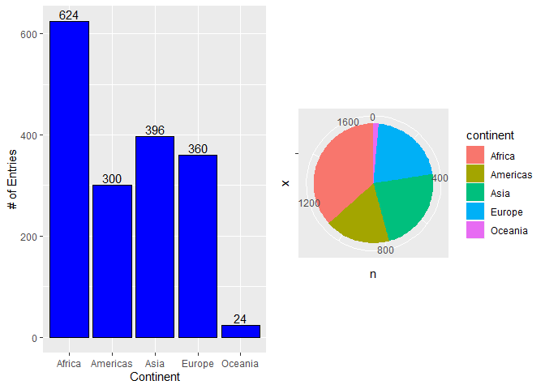
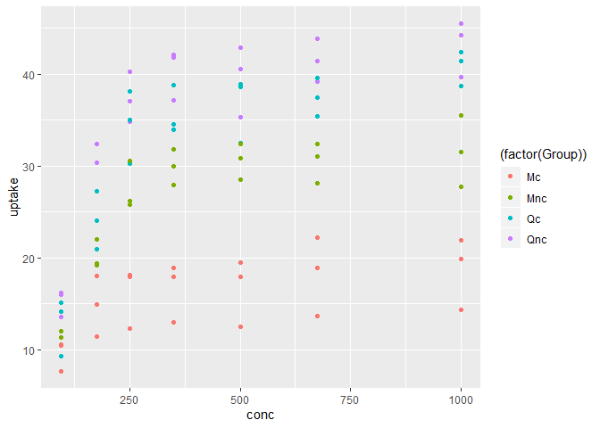

hw02\_gap
================
Avril Metcalfe-Roach
18 September 2019

# **Exercise 1: Dplyr package**

## 1.1 - Subset gapminder to 3 countries, 1970s.

### Countries: Canada, India, Italy

``` r
filtered <- gapminder %>% 
  filter(country %in% c("Canada","India","Italy"), 
         year %in% c(1970:1979))
knitr::kable(filtered, format="markdown")
```

| country | continent | year | lifeExp |       pop |  gdpPercap |
| :------ | :-------- | ---: | ------: | --------: | ---------: |
| Canada  | Americas  | 1972 |  72.880 |  22284500 | 18970.5709 |
| Canada  | Americas  | 1977 |  74.210 |  23796400 | 22090.8831 |
| India   | Asia      | 1972 |  50.651 | 567000000 |   724.0325 |
| India   | Asia      | 1977 |  54.208 | 634000000 |   813.3373 |
| Italy   | Europe    | 1972 |  72.190 |  54365564 | 12269.2738 |
| Italy   | Europe    | 1977 |  73.480 |  56059245 | 14255.9847 |

## 1.2 - Select country, gdpPercap using %\>%

``` r
country_gdp <- filtered %>% 
  select(country,gdpPercap)
knitr::kable(country_gdp, format="markdown")
```

| country |  gdpPercap |
| :------ | ---------: |
| Canada  | 18970.5709 |
| Canada  | 22090.8831 |
| India   |   724.0325 |
| India   |   813.3373 |
| Italy   | 12269.2738 |
| Italy   | 14255.9847 |

## 1.3 - Entries with a negative change in life expectancy from previous line

``` r
exp_list <- gapminder$lifeExp
change <- diff(exp_list,lag=1,differences=1)
# Add NA value to beginning of change vector:
change_2 <- append(change,NA,after=0)
# Create new tibble with delta life expectancy as a column:
gapminder_lifeExp <- gapminder
gapminder_lifeExp$delta <- change_2
# Filter for ALL negative changes
gapminder_redExp <- gapminder_lifeExp %>% 
  filter(delta < 0)

gapminder_redExp
```

    ## # A tibble: 221 x 7
    ##    country    continent  year lifeExp      pop gdpPercap   delta
    ##    <fct>      <fct>     <int>   <dbl>    <int>     <dbl>   <dbl>
    ##  1 Albania    Europe     1992    71.6  3326498     2497.  -0.419
    ##  2 Algeria    Africa     1952    43.1  9279525     2449. -33.3  
    ##  3 Angola     Africa     1952    30.0  4232095     3521. -42.3  
    ##  4 Angola     Africa     1987    39.9  7874230     2430.  -0.036
    ##  5 Australia  Oceania    1952    69.1  8691212    10040.  -6.20 
    ##  6 Austria    Europe     1952    66.8  6927772     6137. -14.4  
    ##  7 Bahrain    Asia       1952    50.9   120447     9867. -28.9  
    ##  8 Bangladesh Asia       1952    37.5 46886859      684. -38.2  
    ##  9 Benin      Africa     1952    38.2  1738315     1063. -41.2  
    ## 10 Benin      Africa     2002    54.4  7026113     1373.  -0.371
    ## # ... with 211 more rows

## 1.4 - Gapminder: max GDP per capita per country

*Original question (using group\_by())*

``` r
# Create new column that lists the max GDP per country
gap_max_gdp <- gapminder %>% 
  group_by(country) %>% 
  mutate(max_gdp = max(gdpPercap)) %>% 
  ungroup()

# Filters gapminder to only show max GDP; removes the redundant 'max GDP' column
max_per_country <- gap_max_gdp %>% 
  filter(gdpPercap == max_gdp) %>% 
  subset(select = -max_gdp)

max_per_country
```

    ## # A tibble: 142 x 6
    ##    country     continent  year lifeExp       pop gdpPercap
    ##    <fct>       <fct>     <int>   <dbl>     <int>     <dbl>
    ##  1 Afghanistan Asia       1982    39.9  12881816      978.
    ##  2 Albania     Europe     2007    76.4   3600523     5937.
    ##  3 Algeria     Africa     2007    72.3  33333216     6223.
    ##  4 Angola      Africa     1967    36.0   5247469     5523.
    ##  5 Argentina   Americas   2007    75.3  40301927    12779.
    ##  6 Australia   Oceania    2007    81.2  20434176    34435.
    ##  7 Austria     Europe     2007    79.8   8199783    36126.
    ##  8 Bahrain     Asia       2007    75.6    708573    29796.
    ##  9 Bangladesh  Asia       2007    64.1 150448339     1391.
    ## 10 Belgium     Europe     2007    79.4  10392226    33693.
    ## # ... with 132 more rows

## 1.5 - Canadian Life Expectancy vs GDP

``` r
# Select data
canadians <- gapminder %>% 
  filter(country=="Canada") %>% 
  select(lifeExp,gdpPercap)

# Plot in ggplot
ggplot(canadians, aes(gdpPercap,lifeExp)) +
  geom_point(alpha=0.5, colour = "red") +
  scale_x_log10("GDP per capita ($)") +
  ylab("Life Expectancy (years)")
```

<!-- -->

# **Exercise 2: Explore individual variables with dplyr**

## Categorical variable: continent

### Possible range of continent

  - Assuming we’re not creating any new continents, this variable is
    inherently limited to the seven continents.
      - *Note*: North & South America are grouped into ‘Americas’
  - Possibilities: c(**Asia, Americas, Europe, Africa, Oceania**,
    Antarctica)
      - *Note*: Antarctica has no entries in gapminder, as it is a
        research base.

### Spread of values

Box and Whisker summary of data:

``` r
con_only <- gapminder %>%
  select(continent)
con_sum <- count(con_only, continent) %>%  # dplyr: table of counts per continent
  as_tibble()
knitr::kable(summary(con_sum),format="markdown") # Print summary of the data
```

|  | continent  | n             |
| :- | :--------- | :------------ |
|  | Africa :1  | Min. : 24.0   |
|  | Americas:1 | 1st Qu.:300.0 |
|  | Asia :1    | Median :360.0 |
|  | Europe :1  | Mean :340.8   |
|  | Oceania :1 | 3rd Qu.:396.0 |
|  | NA         | Max. :624.0   |

``` r
#Visualize the summary in a boxplot
boxplot(con_sum$n, 
        ylab="Number of data entries",
        xlab = "Continents")
```

<!-- -->

The number of datapoints for each populated continent (e.g. Antarctica
not included) **ranged from 24 to 624**. The **mean and median were 341
and 360** respectively, with 50% of the data falling between 300 and 396
entries.

Visual representation of distribution:

``` r
bar_plot <- ggplot(con_sum, aes(continent,n)) +
  geom_col(colour="black",fill="blue") +
  geom_text(aes(label=n), vjust=-0.25) +
  ylab("# of Entries") +
  xlab("Continent")

pie_plot <- ggplot(con_sum, aes(x='',y=n,fill=continent)) +
  geom_bar(width=1, stat = "identity") +
  coord_polar(theta="y")

require(gridExtra) # Arrange them side by side
```

    ## Loading required package: gridExtra

    ## 
    ## Attaching package: 'gridExtra'

    ## The following object is masked from 'package:dplyr':
    ## 
    ##     combine

``` r
gridExtra::grid.arrange(bar_plot,pie_plot,ncol=2)
```

<!-- -->

Generally, Oceania is very underrepresented, comprising just 24 out of
1704 entries. Conversely, African data was included at twice the rate of
the average at 624 entries. The other three continents are relatively
evenly represented.

## Quantitative variable: pop (population)

### Range of pop

The value of pop must be a Natural (\>0) number. No strict upper limit
is specified, but should logically be approximately 1.4 billion (the
population of China).

Visualizing the spread of all population data:

``` r
pop_only <- gapminder %>%
  select(pop)
knitr::kable(summary(pop_only),format="markdown")
```

|  | pop               |
| :- | :---------------- |
|  | Min. :6.001e+04   |
|  | 1st Qu.:2.794e+06 |
|  | Median :7.024e+06 |
|  | Mean :2.960e+07   |
|  | 3rd Qu.:1.959e+07 |
|  | Max. :1.319e+09   |

``` r
boxplot(pop_only$pop, 
        ylab="Population",
        xlab = "")
```

<!-- -->

As demonstrated by the boxplot, the vast majority of the data (all data
within the whiskers/confidence interval) comprise a tiny fraction of the
possible range of population values. **50% of the data decribes a
population between 2.8-19.6 million**, with the median population being
**7 million**. The average is much higher at **29.6 million** as the
high-population outliers are skewing the data. The minimum and maximum
populations are **60 000 and 1.32 billion** respectively.

There are 12 entries for each country, as they were sampled at every
time point. We can divide the data by year to see how the **average
populations change over time**:

``` r
# Linear Plot
pop_time <- gapminder %>% # gapminder is gapminder in tibble format 
  select(year, pop)
pop_time$year <- as.factor(pop_time$year) # Only factors can be used to plot side-by-side boxplots
pop_time_plot <- ggplot(pop_time, aes(year, pop)) +
  geom_boxplot() +
  xlab("Year") +
  ylab("Population") +
  ggtitle("Linear")

# Log Transformed
log_plot <- pop_time_plot + 
  scale_y_log10() +
  ggtitle("Logarithmic")

# Side by Side Output
require(gridExtra)
gridExtra::grid.arrange(pop_time_plot,log_plot,nrow=2)
```

<!-- -->

The above graph makes it easier to see that there are only a couple of
countries that have populations significantly outside of the statistical
range. In the linear plot, the significant population size and fast
growth of China and India in particular make the population growth of
the rest of the world less apparent. By transforming the y axis to a log
10 scale, all of the outliers can be captured and the general trends
become apparent: the **IQR (middle 50%) of the data moves up the y axis,
showing exponential population growth**.

# **Exercise 3: Plot Exploration**

## Scatterplot of \[CO2\]ambient vs \[CO2\]uptake

Dataset: **CO2 - *Carbon Dioxide Uptake in Grass Plants***

Here are the main parameters of the CO2 dataset:

``` r
knitr::kable(summary(CO2),format="markdown")
```

|  | Plant      | Type           | Treatment     | conc         | uptake        |
| :- | :--------- | :------------- | :------------ | :----------- | :------------ |
|  | Qn1 : 7    | Quebec :42     | nonchilled:42 | Min. : 95    | Min. : 7.70   |
|  | Qn2 : 7    | Mississippi:42 | chilled :42   | 1st Qu.: 175 | 1st Qu.:17.90 |
|  | Qn3 : 7    | NA             | NA            | Median : 350 | Median :28.30 |
|  | Qc1 : 7    | NA             | NA            | Mean : 435   | Mean :27.21   |
|  | Qc3 : 7    | NA             | NA            | 3rd Qu.: 675 | 3rd Qu.:37.12 |
|  | Qc2 : 7    | NA             | NA            | Max. :1000   | Max. :45.50   |
|  | (Other):42 | NA             | NA            | NA           | NA            |

Plant is the type of plant, Type is the location of the plant, conc is
the ambient CO2 concentration, and uptake is the CO2 absorbed by the
plant.

``` r
CO2 %>% 
  mutate(Group = (if_else
                  (Type=="Quebec",
                    if_else
                    (Treatment=="nonchilled","Qnc","Qc"),
                     if_else(Treatment=="nonchilled","Mnc","Mc")))) %>% 
  ggplot(aes(conc,uptake)) +
    geom_point(aes(colour=(factor(Group))))
```

<!-- -->

The above graph shows the change in CO2 uptake as a function of CO2
ambient concentration. In the legend, M/Q denote location (Mississippi
vs Quebec) and c/nc denote treatment (chilled/not chilled).

From the plot, it can be seen that Quebec plants are more efficient at
carbon fixation than Mississippi plants, and chilling the plants reduces
their efficiency.

## Graph \#2

Dataset: **esoph - *Smoking, Alcohol and (O)esophageal Cancer***

Here are the main parameters of the CO2 dataset:

``` r
esoph_cancer <- esoph %>% 
  rename("Alcohol Intake"=alcgp) %>% 
  rename("Tobacco Intake"=tobgp)

knitr::kable(summary(esoph_cancer),format="markdown")
```

|  | agegp    | Alcohol Intake | Tobacco Intake | ncases         | ncontrols     |
| :- | :------- | :------------- | :------------- | :------------- | :------------ |
|  | 25-34:15 | 0-39g/day:23   | 0-9g/day:24    | Min. : 0.000   | Min. : 1.00   |
|  | 35-44:15 | 40-79 :23      | 10-19 :24      | 1st Qu.: 0.000 | 1st Qu.: 3.00 |
|  | 45-54:16 | 80-119 :21     | 20-29 :20      | Median : 1.000 | Median : 6.00 |
|  | 55-64:16 | 120+ :21       | 30+ :20        | Mean : 2.273   | Mean :11.08   |
|  | 65-74:15 | NA             | NA             | 3rd Qu.: 4.000 | 3rd Qu.:14.00 |
|  | 75+ :11  | NA             | NA             | Max. :17.000   | Max. :60.00   |

*Note: Ncases and ncontrols summaries are meaningless, as they supply
weightings to the alcohol and tobacco groups.*

We will be looking at the **rate of esophageal cancer relative to
alcohol consumption** and irrespective of age.

``` r
# Collapse data: sum cases/controls by alcohol group
p2 <- aggregate(cbind(esoph_cancer$ncases,esoph_cancer$ncontrols), 
                by=list(esoph_cancer$`Alcohol Intake`), 
                FUN=sum)

cases <- mutate(p2,status="case") %>% 
  rename("total"=V1) %>% 
  select(-V2)
ctrls <- mutate(p2,status="ctrl") %>% 
  rename("total"=V2) %>% 
  select(-V1)
all_data <- merge(cases,ctrls,all=TRUE)

all_39 <- filter(all_data,Group.1=="0-39g/day")
all_79 <- filter(all_data,Group.1=="40-79")
all_119 <- filter(all_data,Group.1=="80-119")
all_120 <- filter(all_data,Group.1=="120+")

esoph_pie <- function(df){
  ggplot(df, aes(x='',y=total,fill=status,)) +
      geom_bar(width=1,stat="identity") +
      coord_polar(theta="y") +
      guides(fill = FALSE, color = FALSE, linetype = FALSE, shape = FALSE) +
      ggtitle(df$Group.1[1])
}

g1 <- esoph_pie(all_39)
g2 <- esoph_pie(all_79)
g3 <- esoph_pie(all_119)
g4 <- esoph_pie(all_120)

require(gridExtra)
gridExtra::grid.arrange(g1,g2,g3,g4,ncol=4)
```

<!-- -->

The esophageal cancer cases are represented by pink, while the controls
are in blue. Titles indicate the number of grams of alcohol ingested per
day. As the alcohol intake increases, so do the overall cancer rate.

# **Recycling**

Code in question:

``` r
filter(gapminder, country == c("Rwanda", "Afghanistan"))
```

    ## # A tibble: 12 x 6
    ##    country     continent  year lifeExp      pop gdpPercap
    ##    <fct>       <fct>     <int>   <dbl>    <int>     <dbl>
    ##  1 Afghanistan Asia       1957    30.3  9240934      821.
    ##  2 Afghanistan Asia       1967    34.0 11537966      836.
    ##  3 Afghanistan Asia       1977    38.4 14880372      786.
    ##  4 Afghanistan Asia       1987    40.8 13867957      852.
    ##  5 Afghanistan Asia       1997    41.8 22227415      635.
    ##  6 Afghanistan Asia       2007    43.8 31889923      975.
    ##  7 Rwanda      Africa     1952    40    2534927      493.
    ##  8 Rwanda      Africa     1962    43    3051242      597.
    ##  9 Rwanda      Africa     1972    44.6  3992121      591.
    ## 10 Rwanda      Africa     1982    46.2  5507565      882.
    ## 11 Rwanda      Africa     1992    23.6  7290203      737.
    ## 12 Rwanda      Africa     2002    43.4  7852401      786.

Though at first glance this code appears to select the data for
Afghanistan and Rwanda, but **half of the data is missing**. Every other
entry is omitted, in a way where both countries are never represented in
the same year. (ex. Rwanda 1952, Afghanistan 1957…)

Because of the inclusion of a list, the function will go along the
year-sorted data, taking turns selecting each country for each value of
year. The code can be fixed by using an ‘or’ statement:

``` r
filter(gapminder, country == "Rwanda" | country == "Afghanistan")
```

    ## # A tibble: 24 x 6
    ##    country     continent  year lifeExp      pop gdpPercap
    ##    <fct>       <fct>     <int>   <dbl>    <int>     <dbl>
    ##  1 Afghanistan Asia       1952    28.8  8425333      779.
    ##  2 Afghanistan Asia       1957    30.3  9240934      821.
    ##  3 Afghanistan Asia       1962    32.0 10267083      853.
    ##  4 Afghanistan Asia       1967    34.0 11537966      836.
    ##  5 Afghanistan Asia       1972    36.1 13079460      740.
    ##  6 Afghanistan Asia       1977    38.4 14880372      786.
    ##  7 Afghanistan Asia       1982    39.9 12881816      978.
    ##  8 Afghanistan Asia       1987    40.8 13867957      852.
    ##  9 Afghanistan Asia       1992    41.7 16317921      649.
    ## 10 Afghanistan Asia       1997    41.8 22227415      635.
    ## # ... with 14 more rows

In this way, all of the data are collected.

# **Tibbles**

All small tables as knitr::kable(). **DT::datatable() only works in
html; therefore, the .Rmd and html file on github contains datatable()
format for large tables, but as\_tibble() is used in the .md file.**
