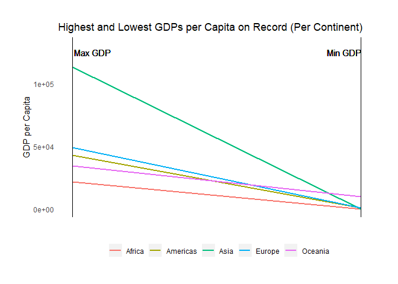

*Note: just for fun, the tibble was reformatted as a kable for aesthetic purposes using the kableExtra package.*

### Task Option 2: Max/min GDP per capita, per continent

The maximum and minimum recorded GDP per capita was extracted from the gapminder dataset for each continent, along with the accompanying country.

<table class="table table-striped table-hover" style="width: auto !important; margin-left: auto; margin-right: auto;">
 <thead>
  <tr>
   <th style="text-align:left;"> continent </th>
   <th style="text-align:right;"> Max GDP </th>
   <th style="text-align:left;"> Max Country </th>
   <th style="text-align:right;"> Max Year </th>
   <th style="text-align:right;"> Min GDP </th>
   <th style="text-align:left;"> Min Country </th>
   <th style="text-align:right;"> Min Year </th>
  </tr>
 </thead>
<tbody>
  <tr>
   <td style="text-align:left;font-weight: bold;"> Africa </td>
   <td style="text-align:right;color: green !important;"> $21,951.21 </td>
   <td style="text-align:left;"> Libya </td>
   <td style="text-align:right;"> 1977 </td>
   <td style="text-align:right;color: red !important;"> $241.17 </td>
   <td style="text-align:left;"> Congo, Dem. Rep. </td>
   <td style="text-align:right;"> 2002 </td>
  </tr>
  <tr>
   <td style="text-align:left;font-weight: bold;"> Americas </td>
   <td style="text-align:right;color: green !important;"> $42,951.65 </td>
   <td style="text-align:left;"> United States </td>
   <td style="text-align:right;"> 2007 </td>
   <td style="text-align:right;color: red !important;"> $1,201.64 </td>
   <td style="text-align:left;"> Haiti </td>
   <td style="text-align:right;"> 2007 </td>
  </tr>
  <tr>
   <td style="text-align:left;font-weight: bold;"> Asia </td>
   <td style="text-align:right;color: green !important;"> $113,523.13 </td>
   <td style="text-align:left;"> Kuwait </td>
   <td style="text-align:right;"> 1957 </td>
   <td style="text-align:right;color: red !important;"> $331.00 </td>
   <td style="text-align:left;"> Myanmar </td>
   <td style="text-align:right;"> 1952 </td>
  </tr>
  <tr>
   <td style="text-align:left;font-weight: bold;"> Europe </td>
   <td style="text-align:right;color: green !important;"> $49,357.19 </td>
   <td style="text-align:left;"> Norway </td>
   <td style="text-align:right;"> 2007 </td>
   <td style="text-align:right;color: red !important;"> $973.53 </td>
   <td style="text-align:left;"> Bosnia and Herzegovina </td>
   <td style="text-align:right;"> 1952 </td>
  </tr>
  <tr>
   <td style="text-align:left;font-weight: bold;"> Oceania </td>
   <td style="text-align:right;color: green !important;"> $34,435.37 </td>
   <td style="text-align:left;"> Australia </td>
   <td style="text-align:right;"> 2007 </td>
   <td style="text-align:right;color: red !important;"> $10,039.60 </td>
   <td style="text-align:left;"> Australia </td>
   <td style="text-align:right;"> 1952 </td>
  </tr>
</tbody>
</table>

 The table above demonstrates that there is a striking range of GDPs per capita across each continent, with differences of up to ~300x between the richest and poorest countries. It should be noted that some of the difference is attributable to inflation (e.g. for Europe and Oceania, the lowest/highest GDPs are found in the first/last years).
 
<!-- -->

These data were then plotted into a slope graph, as seen above. By plotting the maximum and minimum GDPs on the left and right axes and connecting them by continent, two key factors can be easily analyzed: 

**1. Difference between highest and lowest GDPs of any continent** - Asia (green) has a particularly large difference between the two GDPs of interest, whereas all of the other continents have a relatively consistent spread of GDPs.

**2. Relative trends between continents** - The spread of highest GDPs is larger than that of the lowest GDPs. This can be rationalized; there is a natural lower limit for GDPs (zero), whereas there is no meaningful upper limit; wealth tends to increase exponentially.

### Site Map

*[Assignment Repository](https://armetcal.github.io/html_hw)*

[Assignment 3 Home Page](https://armetcal.github.io/html_hw/hw03)

**[Analysis 1 (Current Page)](https://armetcal.github.io/html_hw/hw03/hw03.html)**

[Analysis 2](https://armetcal.github.io/html_hw/hw03/hw03_2.html)

[Analysis 3](https://armetcal.github.io/html_hw/hw03/hw03_3.html)

### References

Kable styling from [kableExtra documentation](https://haozhu233.github.io/kableExtra/awesome_table_in_html.html).

Numbers in the kable reformatted to currency ($) using the currency package, as described by Santosh on [StackOverflow](https://stackoverflow.com/questions/47664055/r-displaying-numbers-as-currency-in-knitrkable).
 
Table layout inspired by the slope graph from [r-statistics.com](http://r-statistics.co/Top50-Ggplot2-Visualizations-MasterList-R-Code.html#Animated%20Bubble%20Plot).
