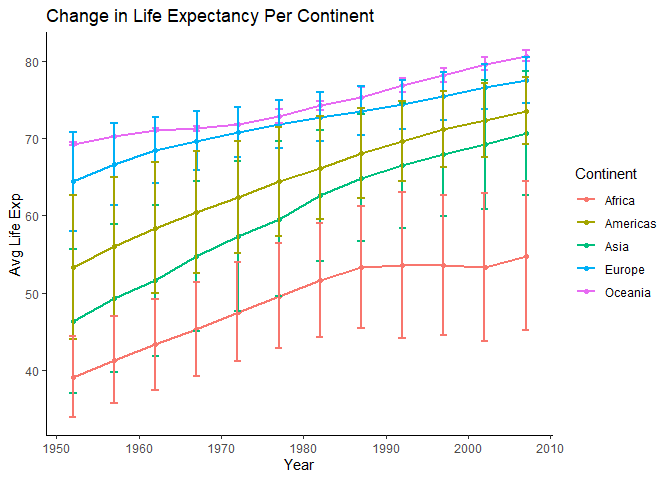

# Task Option 5: Life Expectancy over Time, Per Continent
The gapminder dataset was used to identify how life expectancy has changed over time, on a per-continent basis.

```
## # A tibble: 60 x 4
## # Groups:   Continent [5]
##    Continent  Year `Avg Life Exp` `Std Dev Life Exp`
##    <fct>     <int>          <dbl>              <dbl>
##  1 Africa     1952           39.1                5.2
##  2 Africa     1957           41.3                5.6
##  3 Africa     1962           43.3                5.9
##  4 Africa     1967           45.3                6.1
##  5 Africa     1972           47.5                6.4
##  6 Africa     1977           49.6                6.8
##  7 Africa     1982           51.6                7.4
##  8 Africa     1987           53.3                7.9
##  9 Africa     1992           53.6                9.5
## 10 Africa     1997           53.6                9.1
## # ... with 50 more rows
```


<!-- -->
<!-- Error bars: http://www.sthda.com/english/wiki/ggplot2-error-bars-quick-start-guide-r-software-and-data-visualization-->

