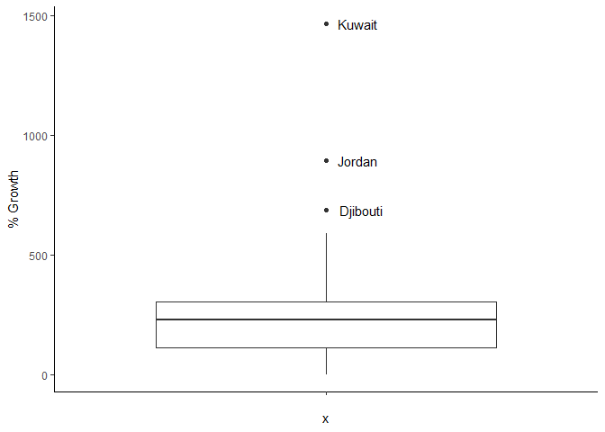
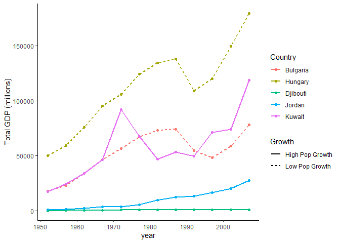
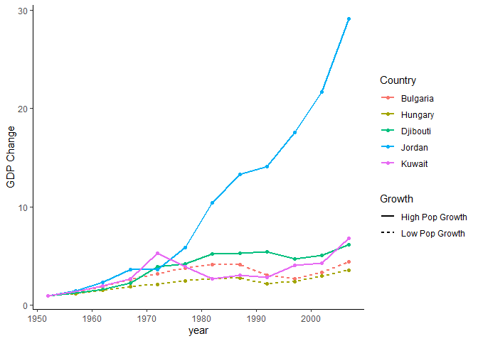
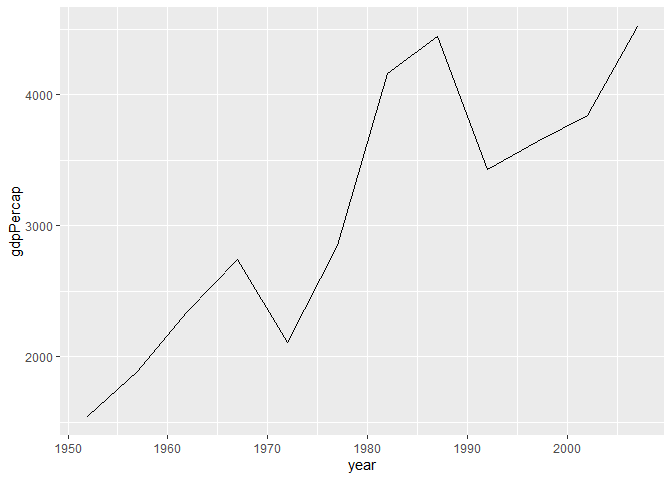

# Task Option 6: Find an Interesting Story!


```
## # A tibble: 142 x 5
##    country          `1952`   `2007` `Pop Change` `% Growth`
##    <fct>             <int>    <int>        <int>      <dbl>
##  1 Bulgaria        7274900  7322858        47958      0.659
##  2 Hungary         9504000  9956108       452108      4.76 
##  3 Czech Republic  9125183 10228744      1103561     12.1  
##  4 Croatia         3882229  4493312       611083     15.7  
##  5 Austria         6927772  8199783      1272011     18.4  
##  6 Belgium         8730405 10392226      1661821     19.0  
##  7 Germany        69145952 82400996     13255044     19.2  
##  8 United Kingdom 50430000 60776238     10346238     20.5  
##  9 Italy          47666000 58147733     10481733     22.0  
## 10 Portugal        8526050 10642836      2116786     24.8  
## # ... with 132 more rows
```
<!-- -->
<!--Labelling outliers: https://stackoverflow.com/questions/33524669/labeling-outliers-of-boxplots-in-r-->

Three countries have unusual increases in population: Kuwait, Jordan, and Djibouti. There are also two countries who have experienced less than 5% growth, though these are not statistically significant: Bulgaria, Hungary.


```
## # A tibble: 5 x 5
##   country   `1952`  `2007` `Pop Change` `% Growth`
##   <fct>      <int>   <int>        <int>      <dbl>
## 1 Bulgaria 7274900 7322858        47958      0.659
## 2 Hungary  9504000 9956108       452108      4.76 
## 3 Djibouti   63149  496374       433225    686.   
## 4 Jordan    607914 6053193      5445279    896.   
## 5 Kuwait    160000 2505559      2345559   1466.
```

How has the total GDP changed with these countries?


```
## # A tibble: 60 x 9
## # Groups:   Country [5]
##    Country continent  year lifeExp    pop gdpPercap `Total GDP (mil~ Growth
##    <fct>   <fct>     <int>   <dbl>  <int>     <dbl>            <dbl> <chr> 
##  1 Bulgar~ Europe     1952    59.6 7.27e6     2444.           17782. Low P~
##  2 Djibou~ Africa     1952    34.8 6.31e4     2670.             169. High ~
##  3 Hungary Europe     1952    64.0 9.50e6     5264.           50026. Low P~
##  4 Jordan  Asia       1952    43.2 6.08e5     1547.             940. High ~
##  5 Kuwait  Asia       1952    55.6 1.60e5   108382.           17341. High ~
##  6 Bulgar~ Europe     1957    66.6 7.65e6     3009.           23020. Low P~
##  7 Djibou~ Africa     1957    37.3 7.19e4     2865.             206. High ~
##  8 Hungary Europe     1957    66.4 9.84e6     6040.           59429. Low P~
##  9 Jordan  Asia       1957    45.7 7.47e5     1886.            1408. High ~
## 10 Kuwait  Asia       1957    58.0 2.13e5   113523.           24163. High ~
## # ... with 50 more rows, and 1 more variable: `GDP Change` <dbl>
```

<!-- -->

At first glance, Kuwait is very interesting. Despite its remarkably high population growth rate, its total GDP has managed to increase at a rate that matches the countries with the lowest population growth rates. However, this graph is misleading, as countries that start at a higher GDP will appear to have more GDP growth than countries starting at a lower GDP, even if they have the same rate of exponential growth. For this reason, the *Total GDP* for each country was normalized so that the GDP was represented as a fold change to the first (1952) entry:

<!-- -->

The graph above shows that the Total GDP rate of change is actually very similar for 4 of the 5 countries, regardless of population growth. Jordan, however, has experienced both an incredible increase in population and total GDP.
<!-- -->

