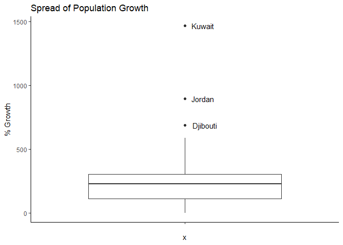
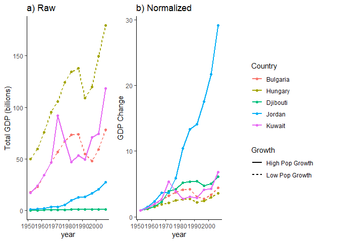

### Task Option 6: Find an Interesting Story!

For this question, I was interested in determining which countries experienced a significantly different rate of population growth over the course of the study, and the subsequent effects on the country's GDP.

First, the gapminder dataset was summarized by country to include the populations at the beginning (1952) and end (2007) of the study, and the subsequent change in population (`Pop Change = 2007-1957`). The latter was normalized to represent a % increase from 1957 (`% Growth = (Pop Change/1952)*100`).


```
## # A tibble: 142 x 5
##    country          `1952`   `2007` `Pop Change` `% Growth`
##    <fct>             <int>    <int>        <int>      <dbl>
##  1 Bulgaria        7274900  7322858        47958      0.659
##  2 Hungary         9504000  9956108       452108      4.76 
##  3 Czech Republic  9125183 10228744      1103561     12.1  
##  4 Croatia         3882229  4493312       611083     15.7  
##  5 Austria         6927772  8199783      1272011     18.4  
##  6 Belgium         8730405 10392226      1661821     19.0  
##  7 Germany        69145952 82400996     13255044     19.2  
##  8 United Kingdom 50430000 60776238     10346238     20.5  
##  9 Italy          47666000 58147733     10481733     22.0  
## 10 Portugal        8526050 10642836      2116786     24.8  
## # ... with 132 more rows
```

These data were then represented in a histogram. Any countries that had statistically different population growths were identified (see References) and their names were labelled on the plot.

<!-- -->

The median population growth was 245%. Three countries have unusual increases in population: Kuwait, Jordan, and Djibouti. Conversely, two countries who have experienced less than 5% growth were identified from the initial table, though these are not statistically significant: Bulgaria, Hungary. These countries are summarized in the table below:


```
## # A tibble: 5 x 5
##   country   `1952`  `2007` `Pop Change` `% Growth`
##   <fct>      <int>   <int>        <int>      <dbl>
## 1 Bulgaria 7274900 7322858        47958      0.659
## 2 Hungary  9504000 9956108       452108      4.76 
## 3 Djibouti   63149  496374       433225    686.   
## 4 Jordan    607914 6053193      5445279    896.   
## 5 Kuwait    160000 2505559      2345559   1466.
```

Objective 2 was to determine how the total GDP changed in these countries over time, to serve as a reflection of how the overall wealth of the country changes relative to the number of citizens. Total GDP is defined here as `GDP per capita * population`.

A new variable, `Total GDP (billions)`, was added to the gapminder dataset as described above. The data were normalized by adding another variable, `GDP Change`, that expresses the Total GDP as a fold change from the first recorded Total GDP in 1952.


<!-- -->

In the Raw Total GDP plot, Kuwait is interesting. Despite its remarkably high population growth rate, its total GDP mirrors the countries with the lowest population growth rates.

However, the raw data graph is misleading, as countries such as Kuwait that start at a higher GDP will appear to have more GDP growth than countries starting at a lower GDP, even if they have the same **rate** of exponential growth. When the data are normalized, it can be seen that 4/5 countries - including Kuwait - experience similar rates of GDP growth. Jordan, however, has experienced both an incredible increase in population and total GDP. Their Total GDP increases by a factor of 30 over the course of the study, far exceeding their 9-fold increase in population; in other words, Jordan experienced unusually high increases in both population and prosperity over the course of the study. 


### Site Map

*[Assignment Repository](https://armetcal.github.io/html_hw)*

[Assignment 3 Home Page](https://armetcal.github.io/html_hw/hw03)

[Analysis 1](https://armetcal.github.io/html_hw/hw03/hw03.html)

[Analysis 2](https://armetcal.github.io/html_hw/hw03/hw03_2.html)

**[Analysis 3 (Current Page)](https://armetcal.github.io/html_hw/hw03/hw03_3.html)**


### References

Outliers were labelled on the histogram by following the directions outlined by **[JasonAizkalns](https://stackoverflow.com/users/2572423/jasonaizkalns)** on [StackOverflow](https://stackoverflow.com/questions/33524669/labeling-outliers-of-boxplots-in-r).

A common legend was created for the Total GDP graphs by using the code provided by **[Roland](https://stackoverflow.com/users/1412059/roland)** on [StackOverflow](https://stackoverflow.com/questions/13649473/add-a-common-legend-for-combined-ggplots).
