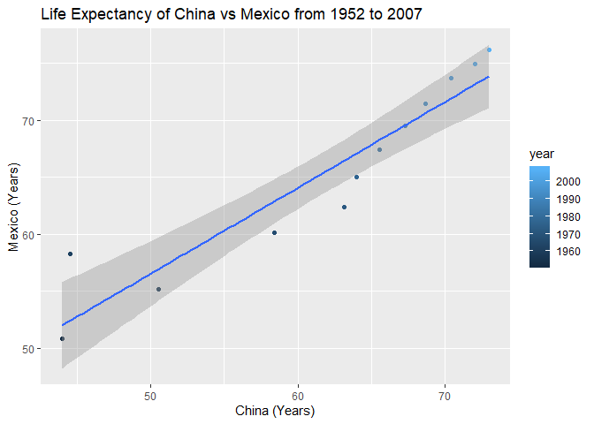

# PART 1: Univariate Exercise: Option 1

Gapminder was modified to include only the countries **Rwanda, China, and Mexico**, and only the variables **year, country, and life expectancy**. The data were then rearranged using `pivot_wider()` so that each row represented one year, and each country was assigned an additional column under which the life expectancy for that year was recorded.


```
## # A tibble: 12 x 4
##     year China Mexico Rwanda
##    <int> <dbl>  <dbl>  <dbl>
##  1  1952  44     50.8   40  
##  2  1957  50.5   55.2   41.5
##  3  1962  44.5   58.3   43  
##  4  1967  58.4   60.1   44.1
##  5  1972  63.1   62.4   44.6
##  6  1977  64.0   65.0   45  
##  7  1982  65.5   67.4   46.2
##  8  1987  67.3   69.5   44.0
##  9  1992  68.7   71.5   23.6
## 10  1997  70.4   73.7   36.1
## 11  2002  72.0   74.9   43.4
## 12  2007  73.0   76.2   46.2
```

The above dataset was then used to plot the life expectancies of China vs. Mexico.

<!-- -->

In this scatterplot, a relatively linear trend is observed between the life expectancies of the two countries, as shown by the line of best fit. The years of measurement range from dark blue (1952) to light blue (2007). Overall, both countries experienced similar increases in life expectancy.

The data were then pivoted back to the original gapminder layout using `pivot_longer()` (though the filtering and selection of countries/variables was not reversed).


```
## # A tibble: 36 x 3
##     year country lifeExp
##    <int> <chr>     <dbl>
##  1  1952 China      44  
##  2  1952 Mexico     50.8
##  3  1952 Rwanda     40  
##  4  1957 China      50.5
##  5  1957 Mexico     55.2
##  6  1957 Rwanda     41.5
##  7  1962 China      44.5
##  8  1962 Mexico     58.3
##  9  1962 Rwanda     43  
## 10  1967 China      58.4
## # ... with 26 more rows
```


# PART 2: Multivariate Data Reshaping: Option 1

Gapminder was filtered to include only **Canada, United States, and Mexico**, and all variables other than **year, country, life expectancy, and gdp per capita** were discarded.

`pivot_wider()` was then used to modify the dataset so that there were separate columns for each country's life expectancy and gdp per capita per year of measurement.


```
## # A tibble: 12 x 7
##     year lifeExp_Canada lifeExp_Mexico `lifeExp_United~ gdpPercap_Canada
##    <int>          <dbl>          <dbl>            <dbl>            <dbl>
##  1  1952           68.8           50.8             68.4           11367.
##  2  1957           70.0           55.2             69.5           12490.
##  3  1962           71.3           58.3             70.2           13462.
##  4  1967           72.1           60.1             70.8           16077.
##  5  1972           72.9           62.4             71.3           18971.
##  6  1977           74.2           65.0             73.4           22091.
##  7  1982           75.8           67.4             74.6           22899.
##  8  1987           76.9           69.5             75.0           26627.
##  9  1992           78.0           71.5             76.1           26343.
## 10  1997           78.6           73.7             76.8           28955.
## 11  2002           79.8           74.9             77.3           33329.
## 12  2007           80.7           76.2             78.2           36319.
## # ... with 2 more variables: gdpPercap_Mexico <dbl>, `gdpPercap_United
## #   States` <dbl>
```

The above dataset was then reversed to its original (truncated) form using `pivot_longer()`.


```
## # A tibble: 36 x 4
##     year country       lifeExp gdpPercap
##    <int> <chr>           <dbl>     <dbl>
##  1  1952 Canada           68.8    11367.
##  2  1952 Mexico           50.8     3478.
##  3  1952 United States    68.4    13990.
##  4  1957 Canada           70.0    12490.
##  5  1957 Mexico           55.2     4132.
##  6  1957 United States    69.5    14847.
##  7  1962 Canada           71.3    13462.
##  8  1962 Mexico           58.3     4582.
##  9  1962 United States    70.2    16173.
## 10  1967 Canada           72.1    16077.
## # ... with 26 more rows
```


# PART 3: Table Joins


This exercise used two datasets: `guest` and `email`. `guest` contains a variety of guest-specific accommodations for an upcoming wedding, whereas `email` contains guest names and an associated contact email.

### 3.1

`left_join()` was used to add the email associated with each name to the `guest` dataset. Before this was performed, an alternate form of `email` had to be generated, called `sep_email`, as the original dataset contained all members of each wedding party in the same cell. `separate_rows()` was thus used to give each person their own row in the alternate table.


```
## # A tibble: 30 x 8
##    party name  meal_wedding meal_brunch attendance_wedd~ attendance_brun~
##    <dbl> <chr> <chr>        <chr>       <chr>            <chr>           
##  1     1 Somm~ PENDING      PENDING     PENDING          PENDING         
##  2     1 Phil~ vegetarian   Menu C      CONFIRMED        CONFIRMED       
##  3     1 Blan~ chicken      Menu A      CONFIRMED        CONFIRMED       
##  4     1 Emaa~ PENDING      PENDING     PENDING          PENDING         
##  5     2 Blai~ chicken      Menu C      CONFIRMED        CONFIRMED       
##  6     2 Nige~ <NA>         <NA>        CANCELLED        CANCELLED       
##  7     3 Sine~ PENDING      PENDING     PENDING          PENDING         
##  8     4 Ayra~ vegetarian   Menu B      PENDING          PENDING         
##  9     5 Atla~ PENDING      PENDING     PENDING          PENDING         
## 10     5 Denz~ fish         Menu B      CONFIRMED        CONFIRMED       
## # ... with 20 more rows, and 2 more variables: attendance_golf <chr>,
## #   email <chr>
```

### 3.2

`anti_join()` was used on the `sep_email` dataset in order to determine which people have an associated email but are not on the guestlist. Emails were kept in the output because hey, it's not too late to invite them!


```
## Joining, by = "name"
```

```
## # A tibble: 3 x 2
##   name            email                          
##   <chr>           <chr>                          
## 1 Turner Jones    tjjones12@hotmail.ca           
## 2 Albert Marshall themarshallfamily1234@gmail.com
## 3 Vivian Marshall themarshallfamily1234@gmail.com
```

### 3.3

Good news - all three of the remaining people from the previous question can come to the wedding! They were added to the `guest` dataset using `full_join(sep_email)`, which also added each person's contact email to the table.


```
## Joining, by = "name"
```

```
## # A tibble: 33 x 8
##    party name  meal_wedding meal_brunch attendance_wedd~ attendance_brun~
##    <dbl> <chr> <chr>        <chr>       <chr>            <chr>           
##  1     1 Somm~ PENDING      PENDING     PENDING          PENDING         
##  2     1 Phil~ vegetarian   Menu C      CONFIRMED        CONFIRMED       
##  3     1 Blan~ chicken      Menu A      CONFIRMED        CONFIRMED       
##  4     1 Emaa~ PENDING      PENDING     PENDING          PENDING         
##  5     2 Blai~ chicken      Menu C      CONFIRMED        CONFIRMED       
##  6     2 Nige~ <NA>         <NA>        CANCELLED        CANCELLED       
##  7     3 Sine~ PENDING      PENDING     PENDING          PENDING         
##  8     4 Ayra~ vegetarian   Menu B      PENDING          PENDING         
##  9     5 Atla~ PENDING      PENDING     PENDING          PENDING         
## 10     5 Denz~ fish         Menu B      CONFIRMED        CONFIRMED       
## # ... with 23 more rows, and 2 more variables: attendance_golf <chr>,
## #   email <chr>
```

