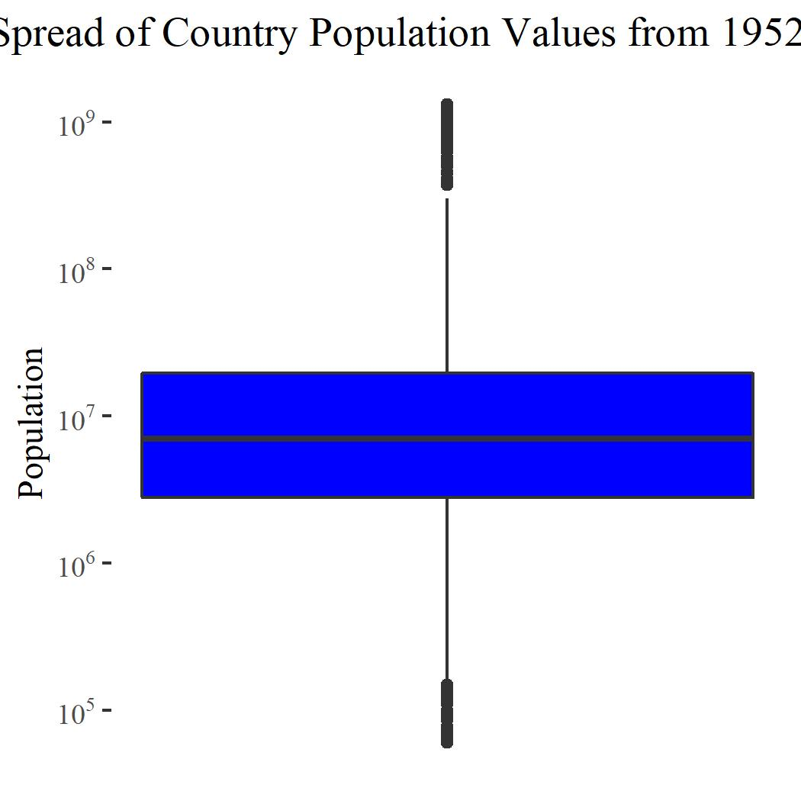
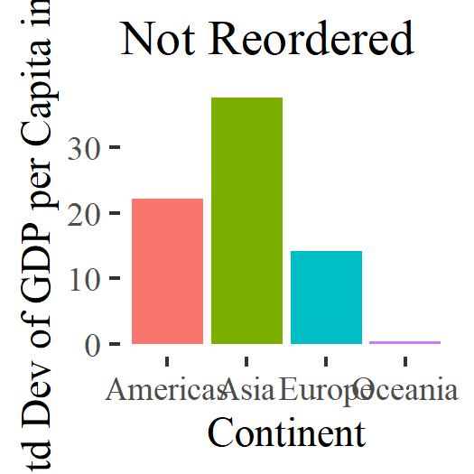
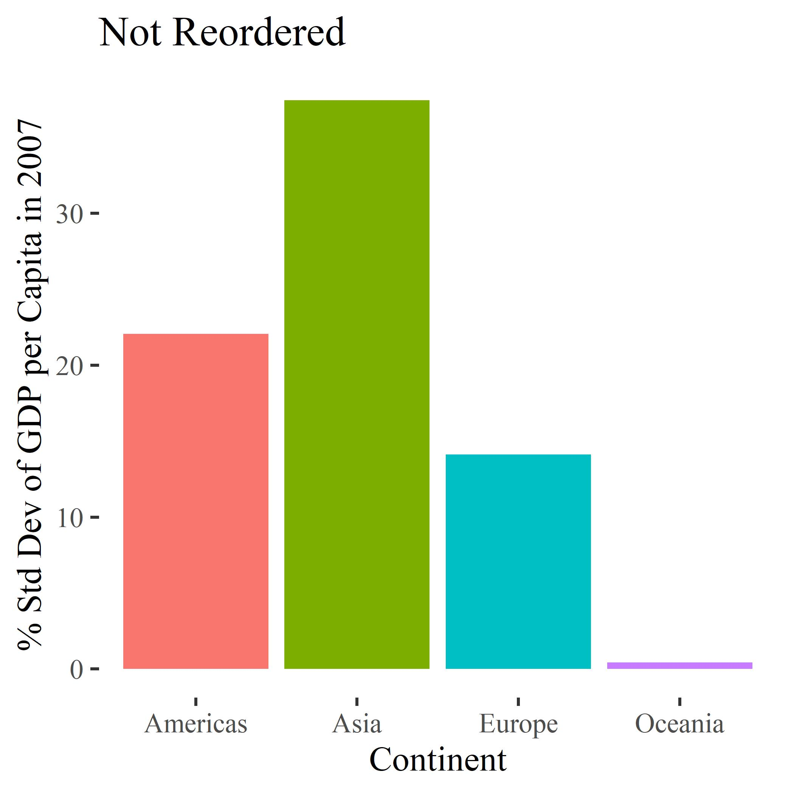
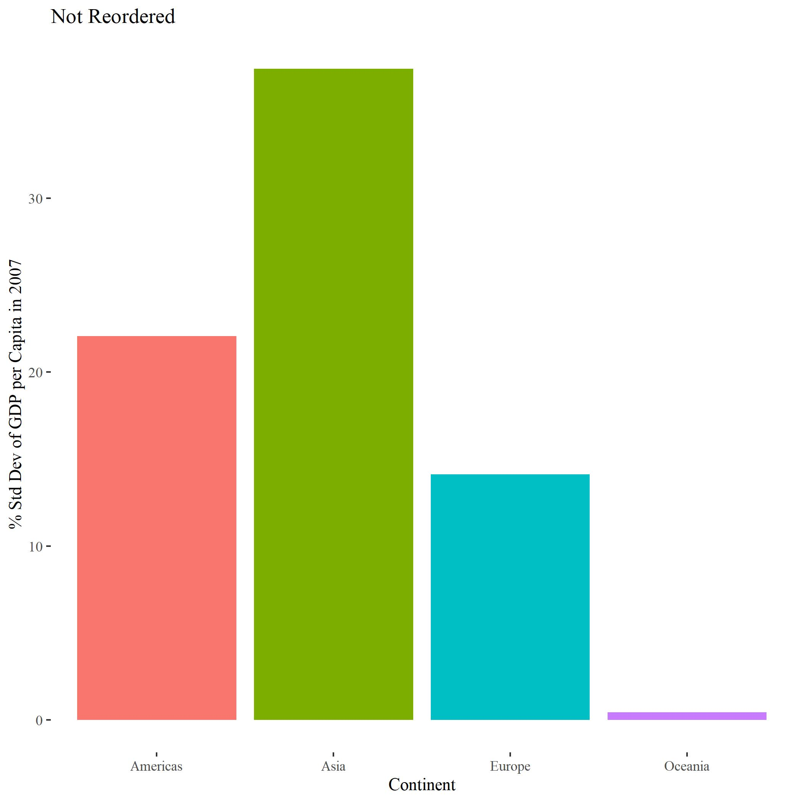
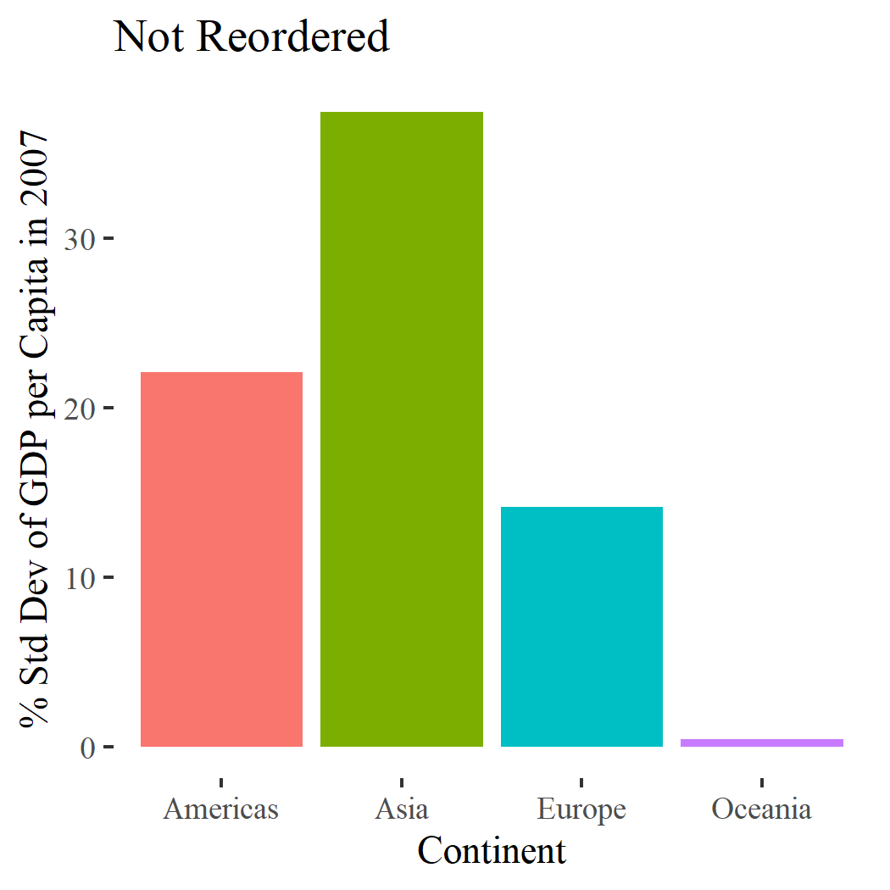

```{r setup, include=FALSE}
knitr::opts_chunk$set(echo = TRUE)
```

```{r libraries, message=FALSE, warning=FALSE, include = FALSE}
library(gapminder)
library(tidyverse)
library(dplyr)
library(here)
library(forcats)
```


## Exercise 1: `here` Package Value

The `here` package (documented [here](https://www.rdocumentation.org/packages/here/versions/0.1)) is an innovative solution to sharing project files across different file locations and operating systems. 

By automatically determining the 'root' directory of a project, it bypasses the need to specify the exact file path for each element included in the code. This allows the project files to be easily moved to different locations around the computer or shared between users, and makes the code more legible by inlcuding only the file name in the written code. It also bridges the gap between different operating systems; instead of changing between forward and back slashes to convert file paths between Windows and Mac, one simply inputs the file name in quotations, leaving the parsing to the R package.

The `here` package is also easy to use. Once the package is loaded, any subfolders beyond the root directory (as defined by `here()`) are called by simply putting the name in quotations. The desired file is then called at the end in quotations. For example, if the project file is stored in the `here()` root directory, then a *file.jpeg* stored in *subfolder* can be accessed like so:

`here('subfolder','file.jpeg')`

This format can also be used to save new files.

Other perks of the `here` package are that it initializes a dedicated, local working directory for the code at hand, so that all items are cleared from the workspace. It also overrides the local working directory that is created by Rmd, which would otherwise cause relative path commands to fail.

## Exercise 2: Factor Management

#### Dataset: `gapminder`
#### Variable: `continent`

In this exercise, the above variable will be identified as a factor

```{r ex2}
# Drop all entries in Africa:
no_a <- filter(gapminder, continent != 'Africa') %>% 
  droplevels()

gap_coun <- gapminder$country
noa_coun <- no_a$country

# Data information before dropping levels:
Class <- class(gap_coun) # Class of country column
Levels <- nlevels(gap_coun) # The number of different values of country
Rows <- nrow(gapminder) # Number of gapminder rows before factor mods
gap_info <- c(Class, Levels, Rows)

# Data information after dropping levels:
Class <- class(noa_coun) # Class of country column
Levels <- nlevels(noa_coun) # The number of different values of country
Rows <- nrow(no_a) # Number of gapminder rows after factor mods
noa_info <- c(Class, Levels, Rows)

# Comparison table:
Values <- c('Class', 'Levels', 'Rows')
tibble::tibble(Variable = Values,
               Pre = gap_info,
               Post = noa_info) %>% 
  knitr::kable()

str(gap_coun) 
str(noa_coun) 
```

```{r Figures, warning=FALSE, message=FALSE}
# Pre-reordering:

# 1. Arrange based on gdpPercap, year:
pre <- gapminder %>% 
  filter(year == 2007) %>% 
  group_by(continent) %>% 
  mutate('% SD 2007' = sd(gdpPercap)/mean(gdpPercap)) %>%
  mutate_at(vars(`% SD 2007`),funs(round(.,3))) %>% 
  ungroup() %>% 
  arrange(-`% SD 2007`,-gdpPercap)

post <- no_a %>% 
  filter(year == 2007) %>% 
  group_by(continent) %>% 
  mutate('% SD 2007' = sd(gdpPercap)/mean(gdpPercap)) %>%
  mutate_at(vars(`% SD 2007`),funs(round(.,3))) %>% 
  ungroup() %>% 
  arrange(-`% SD 2007`,-gdpPercap)

DT::datatable(pre)
DT::datatable(post)
```

```{r reordering, message=FALSE}
# Pre-reordering:
no_reorder <- post %>% 
  ggplot(aes(x=continent, 
             y=`% SD 2007`, 
             fill = continent)) +
  geom_col() +
  xlab('Continent') +
  ylab('% Std Dev of GDP per Capita in 2007') +
  ggtitle('Not Reordered') +
  scale_fill_discrete(name = "Continent") +
  ggthemes::theme_tufte() +
  theme(legend.position='none')
  

# Continents ordered from min to max % SD:
reorder <- post %>% 
  ggplot(aes(x=fct_reorder(continent,`% SD 2007`,min), 
             y=`% SD 2007`, 
             fill = continent)) +
  geom_col() +
  xlab('Continent') +
  ylab('% Std Dev of GDP per Capita in 2007') +
  ggtitle('Reordered (Min to Max)') +
  scale_fill_discrete(name = "Continent") +
  ggthemes::theme_tufte()

# Creating one common legend (see References):
shared_legend<-function(p){
  temp <- ggplot_gtable(ggplot_build(p))
  L <- which(sapply(temp$grobs, function(x) x$name) == "guide-box")
  f_leg <- temp$grobs[[L]]
  return(f_leg)}

leg<-shared_legend(reorder)

# Arrange into side by side plots:
require(gridExtra) # Arrange them side by side
gridExtra::grid.arrange(no_reorder,reorder + theme(legend.position='none'), leg, ncol=3)
```

### References

A common legend was created for the Total GDP graphs by using the code provided by **[Roland](https://stackoverflow.com/users/1412059/roland)** on [StackOverflow](https://stackoverflow.com/questions/13649473/add-a-common-legend-for-combined-ggplots).

## Exercise 3: File input/output (I/O)

```{r .csv}
# Modify gapminder data to include only entries that represent the lowest life expectancy for each country:
modified <- gapminder %>% 
  group_by(country) %>% 
  mutate('min_life' = min(lifeExp)) %>% 
  filter(lifeExp == min_life) %>% 
  ungroup() %>% 
  select(-min_life) %>% 
  as_tibble()

# Export to hw05 file:
write_csv(modified, here::here('hw05','min_life.csv'))
# Import again:
imported <- read_csv(here::here('hw05','min_life.csv'))
# Check for equality:
all.equal(modified, imported)

# Change classes to factors:
imported$country = as.factor(imported$country)
imported$continent = as.factor(imported$continent)
# Sort by most to least recent, then by lifeExp:
imported %>% 
  arrange(-year,lifeExp) %>% 
  DT::datatable()
```

```{r .RDS}
# Export to hw05 file:
saveRDS(modified, here::here('hw05','min_life.rds'))
# Import again:
imported <- readRDS(here::here('hw05','min_life.rds'))

# Check for equality:
all.equal(modified, imported)

# Sort by most to least recent, then by lifeExp:
imported %>% 
  arrange(-year,lifeExp) %>% 
  DT::datatable()
```


## Exercise 4: Visualization design

#### Assignment: #2

```{r Old Plot,out.width="49%",out.height="20%",fig.cap="",fig.show='hold',fig.align='center'}
pop_only <- gapminder %>%
  select(pop)
  
jpeg(file='old.jpeg')
boxplot(pop_only$pop, 
        ylab="Population",
        xlab = "")
dev.off()

jpeg(file='new.jpeg')
pop_only %>% 
  ggplot(aes(y=pop)) +
  geom_boxplot(fill = "blue") +
  ylab("Population") +
  ggtitle("Spread of Country Population Values from 1952-2007") +
  ggthemes::theme_tufte() +
  scale_y_continuous(trans = 'log10',
                    labels = scales::trans_format("log10", scales::math_format(10^.x))) +
  theme(axis.title.x=element_blank(),
        axis.text.x=element_blank(),
        axis.ticks.x=element_blank()) +
  theme(plot.title = element_text(hjust = 0.5))
dev.off()

# Converted to .jpeg because grid.arrange won't accept non-ggplot2 plots
knitr::include_graphics(c("old.jpeg","new.jpeg"))
```

## Exercise 5: Writing figures to file

Graph chosen: `reorder`

```{r Save}
p <- here::here('hw05')

# Explicitly call 'no_reorder' plot as tiny phot:
ggsave('no_reorder.jpeg', no_reorder, width = 3.5, height = 3.5, dpi = 300)
```

### Explicit:


```{r Save2}
# Implicitly call last plot ('reorder')
ggsave('reorder.jpeg', width = 3.5, height = 3.5, dpi = 300)
```

### Implicit:


```{r Save3}
# Play with arguments:
ggsave("small_dim.jpeg", path = p, width = 1.75, height = 1.75, dpi = 300)
```


### Reduce Height/Width:


```{r Save4}
# Play with arguments:
ggsave("low_dpi.jpeg", path = p, width = 3.5, height = 3.5, dpi = 150)
```

### Reduce DPI:


```{r Save5}
# Play with arguments:
ggsave("high_dpi.jpeg", path = p, width = 3.5, height = 3.5, dpi = 600)
```

### Increase DPI:


```{r Save6}
# Play with arguments:
ggsave("low_scale.jpeg", path = p, width = 3.5, height = 3.5, dpi = 300, scale = 0.5)
```

# Reduce scale:


```{r Save7}
# Play with arguments:
ggsave("high_scale.jpeg", path = p, width = 3.5, height = 3.5, dpi = 300, scale = 2)
```

# Increase scale:


```{r Save8}
# Try saving in .png
ggsave('png.png', width = 3.5, height = 3.5, dpi = 300)
```

### Save in .png format:



