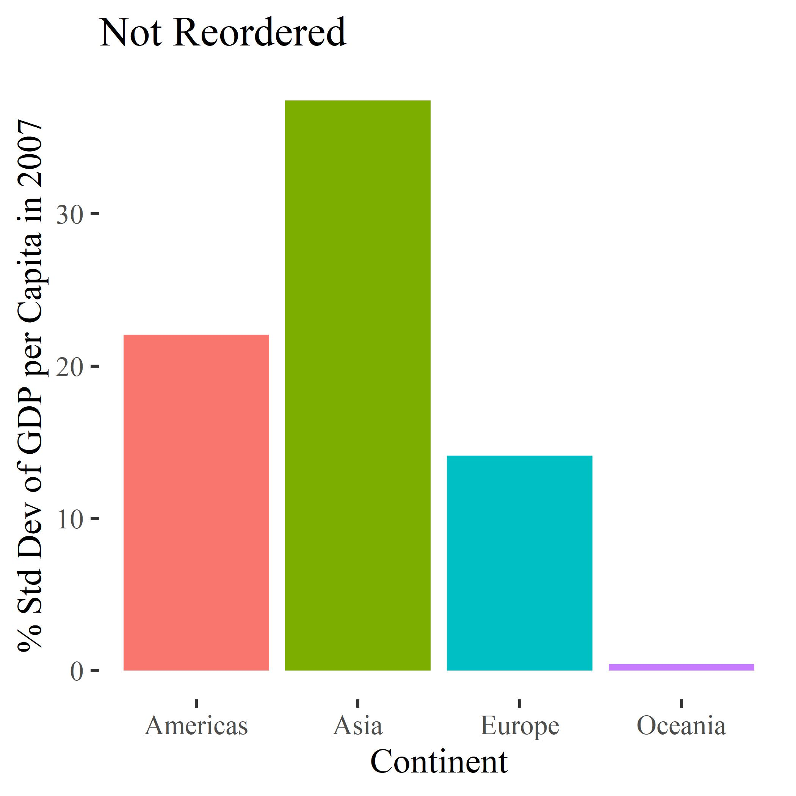
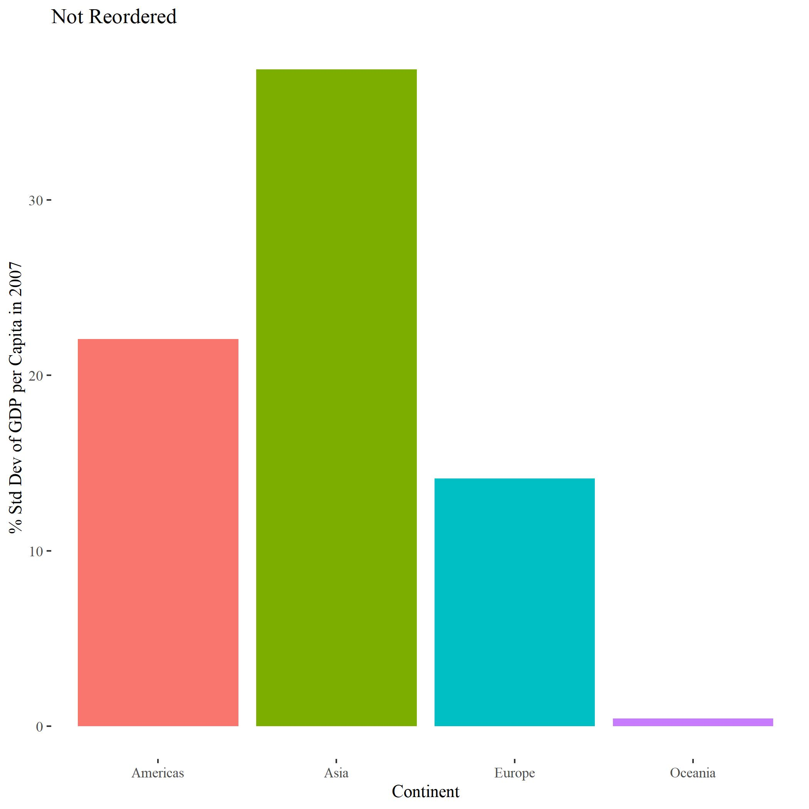

This assignment will explore the incredible virtues of using the `here` package, and demonstrate the subtle complexities of plot specifications.

## Exercise 1: `here` Package Value

The `here` package (documented [here](https://www.rdocumentation.org/packages/here/versions/0.1)) is an innovative solution to sharing project files across different file locations and operating systems. 

By automatically determining the 'root' directory of a project, it bypasses the need to specify the exact file path for each element included in the code. This allows the project files to be easily moved to different locations around the computer or shared between users, and makes the code more legible by inlcuding only the file name in the written code. It also bridges the gap between different operating systems; instead of changing between forward and back slashes to convert file paths between Windows and Mac, one simply inputs the file name in quotations, leaving the parsing to the R package.

The `here` package is also easy to use. Once the package is loaded, any subfolders beyond the root directory (as defined by `here()`) are called by simply putting the name in quotations. The desired file is then called at the end in quotations. For example, if the project file is stored in the `here()` root directory, then a *file.jpeg* stored in *subfolder* can be accessed like so:

`here('subfolder','file.jpeg')`

This format can also be used to save new files.

Other perks of the `here` package are that it initializes a dedicated, local working directory for the code at hand, so that all items are cleared from the workspace. It also overrides the local working directory that is created by Rmd, which would otherwise cause relative path commands to fail.

## Exercise 2: Factor Management

#### Dataset: `gapminder`
#### Variable: `continent`

In this exercise, the `continent` variable will be identified as a factor. Gapminder will then be copied and modified to drop the `Africa` level, plus any other empty levels.

Information about the factor before/after dropping `Africa` was also captured, including the factor class, number of factor levels, and number of total rows in Gapminder.


```r
# Drop all entries in Africa:
no_a <- filter(gapminder, continent != 'Africa') %>% 
  droplevels()

gap_con <- gapminder$continent
noa_con <- no_a$continent

# Data information before dropping levels:
Class <- class(gap_con) # Class of continent column
Levels <- nlevels(gap_con) # The number of different values of continent
Rows <- nrow(gapminder) # Number of gapminder rows before factor mods
gap_info <- c(Class, Levels, Rows)

# Data information after dropping levels:
Class <- class(noa_con) # Class of country column
Levels <- nlevels(noa_con) # The number of different values of country
Rows <- nrow(no_a) # Number of gapminder rows after factor mods
noa_info <- c(Class, Levels, Rows)
```

The factor information was summarized in a table, and the structure (`str()`) was printed below for good measure.


```r
# Comparison table:
Values <- c('Class', 'Levels', 'Rows')
tibble::tibble(Variable = Values,
               Pre = gap_info,
               Post = noa_info) %>% 
  knitr::kable()
```


Variable   Pre      Post   
---------  -------  -------
Class      factor   factor 
Levels     5        4      
Rows       1704     1080   

```r
#Print structures:
str(gap_con) 
```

```
##  Factor w/ 5 levels "Africa","Americas",..: 3 3 3 3 3 3 3 3 3 3 ...
```

```r
str(noa_con) 
```

```
##  Factor w/ 4 levels "Americas","Asia",..: 2 2 2 2 2 2 2 2 2 2 ...
```

Both the original and re-leveled Gapminder datasets were then modified to include only 2007 data. The % Standard Deviation of the GDP per capita (`% SD 2007`) was found on a per-continent basis using the following formula: `'% SD 2007'= sd(gdpPercap)/mean(gdpPercap)`

The data were then arranged from highest to lowest % standard deviation. Continential ties were broken by arranging from highest to lowest GDP per capita. The results were then printed below as datatables.


```r
#Arrange based on gdpPercap, year:

# Original dataset
pre <- gapminder %>% 
  filter(year == 2007) %>% 
  group_by(continent) %>% 
  mutate('% SD 2007' = sd(gdpPercap)/mean(gdpPercap)) %>%
  mutate_at(vars(`% SD 2007`),funs(round(.,3))) %>% 
  ungroup() %>% 
  arrange(-`% SD 2007`,-gdpPercap)

# Post-releveling
post <- no_a %>% 
  filter(year == 2007) %>% 
  group_by(continent) %>% 
  mutate('% SD 2007' = sd(gdpPercap)/mean(gdpPercap)) %>%
  mutate_at(vars(`% SD 2007`),funs(round(.,3))) %>% 
  ungroup() %>% 
  arrange(-`% SD 2007`,-gdpPercap)

#Print datatables
DT::datatable(pre)
```

<!--html_preserve--><div id="htmlwidget-42d575903d95a333555a" style="width:100%;height:auto;" class="datatables html-widget"></div>
<script type="application/json" data-for="htmlwidget-42d575903d95a333555a">{"x":{"filter":"none","data":[["1","2","3","4","5","6","7","8","9","10","11","12","13","14","15","16","17","18","19","20","21","22","23","24","25","26","27","28","29","30","31","32","33","34","35","36","37","38","39","40","41","42","43","44","45","46","47","48","49","50","51","52","53","54","55","56","57","58","59","60","61","62","63","64","65","66","67","68","69","70","71","72","73","74","75","76","77","78","79","80","81","82","83","84","85","86","87","88","89","90","91","92","93","94","95","96","97","98","99","100","101","102","103","104","105","106","107","108","109","110","111","112","113","114","115","116","117","118","119","120","121","122","123","124","125","126","127","128","129","130","131","132","133","134","135","136","137","138","139","140","141","142"],["Gabon","Botswana","Equatorial Guinea","Libya","Mauritius","South Africa","Reunion","Tunisia","Algeria","Egypt","Namibia","Angola","Swaziland","Morocco","Congo, Rep.","Sudan","Djibouti","Cameroon","Nigeria","Mauritania","Senegal","Chad","Sao Tome and Principe","Lesotho","Cote d'Ivoire","Kenya","Benin","Ghana","Zambia","Burkina Faso","Tanzania","Uganda","Madagascar","Mali","Comoros","Guinea","Somalia","Togo","Rwanda","Sierra Leone","Mozambique","Malawi","Gambia","Central African Republic","Ethiopia","Eritrea","Niger","Guinea-Bissau","Zimbabwe","Burundi","Liberia","Congo, Dem. Rep.","Kuwait","Singapore","Hong Kong, China","Japan","Bahrain","Taiwan","Israel","Korea, Rep.","Oman","Saudi Arabia","Malaysia","Iran","Lebanon","Thailand","China","Jordan","Iraq","Syria","Sri Lanka","Indonesia","Philippines","Mongolia","West Bank and Gaza","Pakistan","India","Vietnam","Yemen, Rep.","Cambodia","Korea, Dem. Rep.","Bangladesh","Nepal","Afghanistan","Myanmar","United States","Canada","Puerto Rico","Trinidad and Tobago","Chile","Argentina","Mexico","Venezuela","Uruguay","Panama","Costa Rica","Brazil","Cuba","Peru","Jamaica","Colombia","Ecuador","Dominican Republic","El Salvador","Guatemala","Paraguay","Bolivia","Honduras","Nicaragua","Haiti","Norway","Ireland","Switzerland","Netherlands","Iceland","Austria","Denmark","Sweden","Belgium","Finland","United Kingdom","Germany","France","Spain","Italy","Greece","Slovenia","Czech Republic","Portugal","Slovak Republic","Hungary","Poland","Croatia","Romania","Bulgaria","Serbia","Montenegro","Turkey","Bosnia and Herzegovina","Albania","Australia","New Zealand"],["Africa","Africa","Africa","Africa","Africa","Africa","Africa","Africa","Africa","Africa","Africa","Africa","Africa","Africa","Africa","Africa","Africa","Africa","Africa","Africa","Africa","Africa","Africa","Africa","Africa","Africa","Africa","Africa","Africa","Africa","Africa","Africa","Africa","Africa","Africa","Africa","Africa","Africa","Africa","Africa","Africa","Africa","Africa","Africa","Africa","Africa","Africa","Africa","Africa","Africa","Africa","Africa","Asia","Asia","Asia","Asia","Asia","Asia","Asia","Asia","Asia","Asia","Asia","Asia","Asia","Asia","Asia","Asia","Asia","Asia","Asia","Asia","Asia","Asia","Asia","Asia","Asia","Asia","Asia","Asia","Asia","Asia","Asia","Asia","Asia","Americas","Americas","Americas","Americas","Americas","Americas","Americas","Americas","Americas","Americas","Americas","Americas","Americas","Americas","Americas","Americas","Americas","Americas","Americas","Americas","Americas","Americas","Americas","Americas","Americas","Europe","Europe","Europe","Europe","Europe","Europe","Europe","Europe","Europe","Europe","Europe","Europe","Europe","Europe","Europe","Europe","Europe","Europe","Europe","Europe","Europe","Europe","Europe","Europe","Europe","Europe","Europe","Europe","Europe","Europe","Oceania","Oceania"],[2007,2007,2007,2007,2007,2007,2007,2007,2007,2007,2007,2007,2007,2007,2007,2007,2007,2007,2007,2007,2007,2007,2007,2007,2007,2007,2007,2007,2007,2007,2007,2007,2007,2007,2007,2007,2007,2007,2007,2007,2007,2007,2007,2007,2007,2007,2007,2007,2007,2007,2007,2007,2007,2007,2007,2007,2007,2007,2007,2007,2007,2007,2007,2007,2007,2007,2007,2007,2007,2007,2007,2007,2007,2007,2007,2007,2007,2007,2007,2007,2007,2007,2007,2007,2007,2007,2007,2007,2007,2007,2007,2007,2007,2007,2007,2007,2007,2007,2007,2007,2007,2007,2007,2007,2007,2007,2007,2007,2007,2007,2007,2007,2007,2007,2007,2007,2007,2007,2007,2007,2007,2007,2007,2007,2007,2007,2007,2007,2007,2007,2007,2007,2007,2007,2007,2007,2007,2007,2007,2007,2007,2007],[56.735,50.728,51.579,73.952,72.801,49.339,76.442,73.923,72.301,71.338,52.906,42.731,39.613,71.164,55.322,58.556,54.791,50.43,46.859,64.164,63.062,50.651,65.528,42.592,48.328,54.11,56.728,60.022,42.384,52.295,52.517,51.542,59.443,54.467,65.152,56.007,48.159,58.42,46.242,42.568,42.082,48.303,59.448,44.741,52.947,58.04,56.867,46.388,43.487,49.58,45.678,46.462,77.588,79.972,82.208,82.603,75.635,78.4,80.745,78.623,75.64,72.777,74.241,70.964,71.993,70.616,72.961,72.535,59.545,74.143,72.396,70.65,71.688,66.803,73.422,65.483,64.698,74.249,62.698,59.723,67.297,64.062,63.785,43.828,62.069,78.242,80.653,78.746,69.819,78.553,75.32,76.195,73.747,76.384,75.537,78.782,72.39,78.273,71.421,72.567,72.889,74.994,72.235,71.878,70.259,71.752,65.554,70.198,72.899,60.916,80.196,78.885,81.701,79.762,81.757,79.829,78.332,80.884,79.441,79.313,79.425,79.406,80.657,80.941,80.546,79.483,77.926,76.486,78.098,74.663,73.338,75.563,75.748,72.476,73.005,74.002,74.543,71.777,74.852,76.423,81.235,80.204],[1454867,1639131,551201,6036914,1250882,43997828,798094,10276158,33333216,80264543,2055080,12420476,1133066,33757175,3800610,42292929,496374,17696293,135031164,3270065,12267493,10238807,199579,2012649,18013409,35610177,8078314,22873338,11746035,14326203,38139640,29170398,19167654,12031795,710960,9947814,9118773,5701579,8860588,6144562,19951656,13327079,1688359,4369038,76511887,4906585,12894865,1472041,12311143,8390505,3193942,64606759,2505559,4553009,6980412,127467972,708573,23174294,6426679,49044790,3204897,27601038,24821286,69453570,3921278,65068149,1318683096,6053193,27499638,19314747,20378239,223547000,91077287,2874127,4018332,169270617,1110396331,85262356,22211743,14131858,23301725,150448339,28901790,31889923,47761980,301139947,33390141,3942491,1056608,16284741,40301927,108700891,26084662,3447496,3242173,4133884,190010647,11416987,28674757,2780132,44227550,13755680,9319622,6939688,12572928,6667147,9119152,7483763,5675356,8502814,4627926,4109086,7554661,16570613,301931,8199783,5468120,9031088,10392226,5238460,60776238,82400996,61083916,40448191,58147733,10706290,2009245,10228744,10642836,5447502,9956108,38518241,4493312,22276056,7322858,10150265,684736,71158647,4552198,3600523,20434176,4115771],[13206.48452,12569.85177,12154.08975,12057.49928,10956.99112,9269.657808,7670.122558,7092.923025,6223.367465,5581.180998,4811.060429,4797.231267,4513.480643,3820.17523,3632.557798,2602.394995,2082.481567,2042.09524,2013.977305,1803.151496,1712.472136,1704.063724,1598.435089,1569.331442,1544.750112,1463.249282,1441.284873,1327.60891,1271.211593,1217.032994,1107.482182,1056.380121,1044.770126,1042.581557,986.1478792,942.6542111,926.1410683,882.9699438,863.0884639,862.5407561,823.6856205,759.3499101,752.7497265,706.016537,690.8055759,641.3695236,619.6768924,579.231743,469.7092981,430.0706916,414.5073415,277.5518587,47306.98978,47143.17964,39724.97867,31656.06806,29796.04834,28718.27684,25523.2771,23348.13973,22316.19287,21654.83194,12451.6558,11605.71449,10461.05868,7458.396327,4959.114854,4519.461171,4471.061906,4184.548089,3970.095407,3540.651564,3190.481016,3095.772271,3025.349798,2605.94758,2452.210407,2441.576404,2280.769906,1713.778686,1593.06548,1391.253792,1091.359778,974.5803384,944,42951.65309,36319.23501,19328.70901,18008.50924,13171.63885,12779.37964,11977.57496,11415.80569,10611.46299,9809.185636,9645.06142,9065.800825,8948.102923,7408.905561,7320.880262,7006.580419,6873.262326,6025.374752,5728.353514,5186.050003,4172.838464,3822.137084,3548.330846,2749.320965,1201.637154,49357.19017,40675.99635,37506.41907,36797.93332,36180.78919,36126.4927,35278.41874,33859.74835,33692.60508,33207.0844,33203.26128,32170.37442,30470.0167,28821.0637,28569.7197,27538.41188,25768.25759,22833.30851,20509.64777,18678.31435,18008.94444,15389.92468,14619.22272,10808.47561,10680.79282,9786.534714,9253.896111,8458.276384,7446.298803,5937.029526,34435.36744,25185.00911],[1.171,1.171,1.171,1.171,1.171,1.171,1.171,1.171,1.171,1.171,1.171,1.171,1.171,1.171,1.171,1.171,1.171,1.171,1.171,1.171,1.171,1.171,1.171,1.171,1.171,1.171,1.171,1.171,1.171,1.171,1.171,1.171,1.171,1.171,1.171,1.171,1.171,1.171,1.171,1.171,1.171,1.171,1.171,1.171,1.171,1.171,1.171,1.171,1.171,1.171,1.171,1.171,1.135,1.135,1.135,1.135,1.135,1.135,1.135,1.135,1.135,1.135,1.135,1.135,1.135,1.135,1.135,1.135,1.135,1.135,1.135,1.135,1.135,1.135,1.135,1.135,1.135,1.135,1.135,1.135,1.135,1.135,1.135,1.135,1.135,0.883,0.883,0.883,0.883,0.883,0.883,0.883,0.883,0.883,0.883,0.883,0.883,0.883,0.883,0.883,0.883,0.883,0.883,0.883,0.883,0.883,0.883,0.883,0.883,0.883,0.471,0.471,0.471,0.471,0.471,0.471,0.471,0.471,0.471,0.471,0.471,0.471,0.471,0.471,0.471,0.471,0.471,0.471,0.471,0.471,0.471,0.471,0.471,0.471,0.471,0.471,0.471,0.471,0.471,0.471,0.219,0.219]],"container":"<table class=\"display\">\n  <thead>\n    <tr>\n      <th> <\/th>\n      <th>country<\/th>\n      <th>continent<\/th>\n      <th>year<\/th>\n      <th>lifeExp<\/th>\n      <th>pop<\/th>\n      <th>gdpPercap<\/th>\n      <th>% SD 2007<\/th>\n    <\/tr>\n  <\/thead>\n<\/table>","options":{"columnDefs":[{"className":"dt-right","targets":[3,4,5,6,7]},{"orderable":false,"targets":0}],"order":[],"autoWidth":false,"orderClasses":false}},"evals":[],"jsHooks":[]}</script><!--/html_preserve-->

```r
DT::datatable(post)
```

<!--html_preserve--><div id="htmlwidget-c8e8d5ac00fb07fdb3b1" style="width:100%;height:auto;" class="datatables html-widget"></div>
<script type="application/json" data-for="htmlwidget-c8e8d5ac00fb07fdb3b1">{"x":{"filter":"none","data":[["1","2","3","4","5","6","7","8","9","10","11","12","13","14","15","16","17","18","19","20","21","22","23","24","25","26","27","28","29","30","31","32","33","34","35","36","37","38","39","40","41","42","43","44","45","46","47","48","49","50","51","52","53","54","55","56","57","58","59","60","61","62","63","64","65","66","67","68","69","70","71","72","73","74","75","76","77","78","79","80","81","82","83","84","85","86","87","88","89","90"],["Kuwait","Singapore","Hong Kong, China","Japan","Bahrain","Taiwan","Israel","Korea, Rep.","Oman","Saudi Arabia","Malaysia","Iran","Lebanon","Thailand","China","Jordan","Iraq","Syria","Sri Lanka","Indonesia","Philippines","Mongolia","West Bank and Gaza","Pakistan","India","Vietnam","Yemen, Rep.","Cambodia","Korea, Dem. Rep.","Bangladesh","Nepal","Afghanistan","Myanmar","United States","Canada","Puerto Rico","Trinidad and Tobago","Chile","Argentina","Mexico","Venezuela","Uruguay","Panama","Costa Rica","Brazil","Cuba","Peru","Jamaica","Colombia","Ecuador","Dominican Republic","El Salvador","Guatemala","Paraguay","Bolivia","Honduras","Nicaragua","Haiti","Norway","Ireland","Switzerland","Netherlands","Iceland","Austria","Denmark","Sweden","Belgium","Finland","United Kingdom","Germany","France","Spain","Italy","Greece","Slovenia","Czech Republic","Portugal","Slovak Republic","Hungary","Poland","Croatia","Romania","Bulgaria","Serbia","Montenegro","Turkey","Bosnia and Herzegovina","Albania","Australia","New Zealand"],["Asia","Asia","Asia","Asia","Asia","Asia","Asia","Asia","Asia","Asia","Asia","Asia","Asia","Asia","Asia","Asia","Asia","Asia","Asia","Asia","Asia","Asia","Asia","Asia","Asia","Asia","Asia","Asia","Asia","Asia","Asia","Asia","Asia","Americas","Americas","Americas","Americas","Americas","Americas","Americas","Americas","Americas","Americas","Americas","Americas","Americas","Americas","Americas","Americas","Americas","Americas","Americas","Americas","Americas","Americas","Americas","Americas","Americas","Europe","Europe","Europe","Europe","Europe","Europe","Europe","Europe","Europe","Europe","Europe","Europe","Europe","Europe","Europe","Europe","Europe","Europe","Europe","Europe","Europe","Europe","Europe","Europe","Europe","Europe","Europe","Europe","Europe","Europe","Oceania","Oceania"],[2007,2007,2007,2007,2007,2007,2007,2007,2007,2007,2007,2007,2007,2007,2007,2007,2007,2007,2007,2007,2007,2007,2007,2007,2007,2007,2007,2007,2007,2007,2007,2007,2007,2007,2007,2007,2007,2007,2007,2007,2007,2007,2007,2007,2007,2007,2007,2007,2007,2007,2007,2007,2007,2007,2007,2007,2007,2007,2007,2007,2007,2007,2007,2007,2007,2007,2007,2007,2007,2007,2007,2007,2007,2007,2007,2007,2007,2007,2007,2007,2007,2007,2007,2007,2007,2007,2007,2007,2007,2007],[77.588,79.972,82.208,82.603,75.635,78.4,80.745,78.623,75.64,72.777,74.241,70.964,71.993,70.616,72.961,72.535,59.545,74.143,72.396,70.65,71.688,66.803,73.422,65.483,64.698,74.249,62.698,59.723,67.297,64.062,63.785,43.828,62.069,78.242,80.653,78.746,69.819,78.553,75.32,76.195,73.747,76.384,75.537,78.782,72.39,78.273,71.421,72.567,72.889,74.994,72.235,71.878,70.259,71.752,65.554,70.198,72.899,60.916,80.196,78.885,81.701,79.762,81.757,79.829,78.332,80.884,79.441,79.313,79.425,79.406,80.657,80.941,80.546,79.483,77.926,76.486,78.098,74.663,73.338,75.563,75.748,72.476,73.005,74.002,74.543,71.777,74.852,76.423,81.235,80.204],[2505559,4553009,6980412,127467972,708573,23174294,6426679,49044790,3204897,27601038,24821286,69453570,3921278,65068149,1318683096,6053193,27499638,19314747,20378239,223547000,91077287,2874127,4018332,169270617,1110396331,85262356,22211743,14131858,23301725,150448339,28901790,31889923,47761980,301139947,33390141,3942491,1056608,16284741,40301927,108700891,26084662,3447496,3242173,4133884,190010647,11416987,28674757,2780132,44227550,13755680,9319622,6939688,12572928,6667147,9119152,7483763,5675356,8502814,4627926,4109086,7554661,16570613,301931,8199783,5468120,9031088,10392226,5238460,60776238,82400996,61083916,40448191,58147733,10706290,2009245,10228744,10642836,5447502,9956108,38518241,4493312,22276056,7322858,10150265,684736,71158647,4552198,3600523,20434176,4115771],[47306.98978,47143.17964,39724.97867,31656.06806,29796.04834,28718.27684,25523.2771,23348.13973,22316.19287,21654.83194,12451.6558,11605.71449,10461.05868,7458.396327,4959.114854,4519.461171,4471.061906,4184.548089,3970.095407,3540.651564,3190.481016,3095.772271,3025.349798,2605.94758,2452.210407,2441.576404,2280.769906,1713.778686,1593.06548,1391.253792,1091.359778,974.5803384,944,42951.65309,36319.23501,19328.70901,18008.50924,13171.63885,12779.37964,11977.57496,11415.80569,10611.46299,9809.185636,9645.06142,9065.800825,8948.102923,7408.905561,7320.880262,7006.580419,6873.262326,6025.374752,5728.353514,5186.050003,4172.838464,3822.137084,3548.330846,2749.320965,1201.637154,49357.19017,40675.99635,37506.41907,36797.93332,36180.78919,36126.4927,35278.41874,33859.74835,33692.60508,33207.0844,33203.26128,32170.37442,30470.0167,28821.0637,28569.7197,27538.41188,25768.25759,22833.30851,20509.64777,18678.31435,18008.94444,15389.92468,14619.22272,10808.47561,10680.79282,9786.534714,9253.896111,8458.276384,7446.298803,5937.029526,34435.36744,25185.00911],[1.135,1.135,1.135,1.135,1.135,1.135,1.135,1.135,1.135,1.135,1.135,1.135,1.135,1.135,1.135,1.135,1.135,1.135,1.135,1.135,1.135,1.135,1.135,1.135,1.135,1.135,1.135,1.135,1.135,1.135,1.135,1.135,1.135,0.883,0.883,0.883,0.883,0.883,0.883,0.883,0.883,0.883,0.883,0.883,0.883,0.883,0.883,0.883,0.883,0.883,0.883,0.883,0.883,0.883,0.883,0.883,0.883,0.883,0.471,0.471,0.471,0.471,0.471,0.471,0.471,0.471,0.471,0.471,0.471,0.471,0.471,0.471,0.471,0.471,0.471,0.471,0.471,0.471,0.471,0.471,0.471,0.471,0.471,0.471,0.471,0.471,0.471,0.471,0.219,0.219]],"container":"<table class=\"display\">\n  <thead>\n    <tr>\n      <th> <\/th>\n      <th>country<\/th>\n      <th>continent<\/th>\n      <th>year<\/th>\n      <th>lifeExp<\/th>\n      <th>pop<\/th>\n      <th>gdpPercap<\/th>\n      <th>% SD 2007<\/th>\n    <\/tr>\n  <\/thead>\n<\/table>","options":{"columnDefs":[{"className":"dt-right","targets":[3,4,5,6,7]},{"orderable":false,"targets":0}],"order":[],"autoWidth":false,"orderClasses":false}},"evals":[],"jsHooks":[]}</script><!--/html_preserve-->

The releveled dataset was then used to demonstrate the effects of reordering the levels using `fct_reorder()`. A common legend was created using code modified from GitHub (please see References below).


```r
# Pre-reordering:
no_reorder <- post %>% 
  ggplot(aes(x=continent, 
             y=`% SD 2007`, 
             fill = continent)) +
  geom_col() +
  xlab('Continent') +
  ylab('% Std Dev of GDP per Capita in 2007') +
  ggtitle('Not Reordered') +
  scale_fill_discrete(name = "Continent") +
  ggthemes::theme_tufte() +
  theme(legend.position='none')
  

# Continents ordered from min to max % SD:
reorder <- post %>% 
  ggplot(aes(x=forcats::fct_reorder
                (continent,`% SD 2007`,min), 
             y=`% SD 2007`, 
             fill = continent)) +
  geom_col() +
  xlab('Continent') +
  ylab('% Std Dev of GDP per Capita in 2007') +
  ggtitle('Reordered (Min to Max)') +
  scale_fill_discrete(name = "Continent") +
  ggthemes::theme_tufte()

# Creating one common legend (see References):
shared_legend<-function(p){
  temp <- ggplot_gtable(ggplot_build(p))
  L <- which(sapply(temp$grobs, function(x) x$name) == "guide-box")
  f_leg <- temp$grobs[[L]]
  return(f_leg)}

leg<-shared_legend(reorder)

# Arrange into side by side plots:
require(gridExtra) # Arrange them side by side
gridExtra::grid.arrange(no_reorder,reorder + theme(legend.position='none'), leg, ncol=3)
```

<!-- -->

### References

A common legend was created for the Total GDP graphs by using the code provided by **[Roland](https://stackoverflow.com/users/1412059/roland)** on [StackOverflow](https://stackoverflow.com/questions/13649473/add-a-common-legend-for-combined-ggplots).

## Exercise 3: File input/output (I/O)

Gapminder was first modified to include only the entries with the lowest life expectancy for each country. The initial datatable is shown below:


```r
# Modify gapminder data to include only entries that represent the lowest life expectancy for each country:
modified <- gapminder %>% 
  group_by(country) %>% 
  mutate('min_life' = min(lifeExp)) %>% 
  filter(lifeExp == min_life) %>% 
  ungroup() %>% 
  select(-min_life) %>% 
  arrange(-year,lifeExp) %>% 
  as_tibble()

DT::datatable(modified)
```

<!--html_preserve--><div id="htmlwidget-368dd9fb8cf821d65996" style="width:100%;height:auto;" class="datatables html-widget"></div>
<script type="application/json" data-for="htmlwidget-368dd9fb8cf821d65996">{"x":{"filter":"none","data":[["1","2","3","4","5","6","7","8","9","10","11","12","13","14","15","16","17","18","19","20","21","22","23","24","25","26","27","28","29","30","31","32","33","34","35","36","37","38","39","40","41","42","43","44","45","46","47","48","49","50","51","52","53","54","55","56","57","58","59","60","61","62","63","64","65","66","67","68","69","70","71","72","73","74","75","76","77","78","79","80","81","82","83","84","85","86","87","88","89","90","91","92","93","94","95","96","97","98","99","100","101","102","103","104","105","106","107","108","109","110","111","112","113","114","115","116","117","118","119","120","121","122","123","124","125","126","127","128","129","130","131","132","133","134","135","136","137","138","139","140","141","142"],["Swaziland","Zambia","Zimbabwe","Botswana","Rwanda","Cambodia","Afghanistan","Gambia","Angola","Sierra Leone","Mozambique","Burkina Faso","Guinea-Bissau","Yemen, Rep.","Somalia","Guinea","Mali","Ethiopia","Equatorial Guinea","Djibouti","Central African Republic","Eritrea","Nepal","Malawi","Myanmar","Nigeria","Madagascar","Gabon","Senegal","India","Niger","Indonesia","Bangladesh","Oman","Haiti","Chad","Benin","Liberia","Cameroon","Togo","Sudan","Burundi","Congo, Dem. Rep.","Saudi Arabia","Uganda","Vietnam","Bolivia","Cote d'Ivoire","Mauritania","Comoros","Tanzania","Namibia","Egypt","Honduras","Guatemala","Congo, Rep.","Lesotho","Mongolia","Kenya","Nicaragua","Libya","Morocco","Algeria","Ghana","Jordan","West Bank and Gaza","Pakistan","Turkey","Peru","China","Tunisia","Iran","South Africa","El Salvador","Iraq","Syria","Dominican Republic","Sao Tome and Principe","Korea, Rep.","Philippines","Ecuador","Malaysia","Korea, Dem. Rep.","Colombia","Mexico","Thailand","Brazil","Bahrain","Mauritius","Reunion","Bosnia and Herzegovina","Chile","Venezuela","Panama","Albania","Kuwait","Lebanon","Costa Rica","Sri Lanka","Serbia","Taiwan","Jamaica","Trinidad and Tobago","Montenegro","Cuba","Bulgaria","Portugal","Singapore","Hong Kong, China","Romania","Croatia","Poland","Argentina","Paraguay","Japan","Hungary","Puerto Rico","Slovak Republic","Spain","Israel","Slovenia","Greece","Italy","Uruguay","Finland","Austria","Czech Republic","Ireland","France","Germany","Belgium","United States","Canada","Australia","United Kingdom","New Zealand","Switzerland","Denmark","Sweden","Netherlands","Iceland","Norway"],["Africa","Africa","Africa","Africa","Africa","Asia","Asia","Africa","Africa","Africa","Africa","Africa","Africa","Asia","Africa","Africa","Africa","Africa","Africa","Africa","Africa","Africa","Asia","Africa","Asia","Africa","Africa","Africa","Africa","Asia","Africa","Asia","Asia","Asia","Americas","Africa","Africa","Africa","Africa","Africa","Africa","Africa","Africa","Asia","Africa","Asia","Americas","Africa","Africa","Africa","Africa","Africa","Africa","Americas","Americas","Africa","Africa","Asia","Africa","Americas","Africa","Africa","Africa","Africa","Asia","Asia","Asia","Europe","Americas","Asia","Africa","Asia","Africa","Americas","Asia","Asia","Americas","Africa","Asia","Asia","Americas","Asia","Asia","Americas","Americas","Asia","Americas","Asia","Africa","Africa","Europe","Americas","Americas","Americas","Europe","Asia","Asia","Americas","Asia","Europe","Asia","Americas","Americas","Europe","Americas","Europe","Europe","Asia","Asia","Europe","Europe","Europe","Americas","Americas","Asia","Europe","Americas","Europe","Europe","Asia","Europe","Europe","Europe","Americas","Europe","Europe","Europe","Europe","Europe","Europe","Europe","Americas","Americas","Oceania","Europe","Oceania","Europe","Europe","Europe","Europe","Europe","Europe"],[2007,2002,2002,2002,1992,1977,1952,1952,1952,1952,1952,1952,1952,1952,1952,1952,1952,1952,1952,1952,1952,1952,1952,1952,1952,1952,1952,1952,1952,1952,1952,1952,1952,1952,1952,1952,1952,1952,1952,1952,1952,1952,1952,1952,1952,1952,1952,1952,1952,1952,1952,1952,1952,1952,1952,1952,1952,1952,1952,1952,1952,1952,1952,1952,1952,1952,1952,1952,1952,1952,1952,1952,1952,1952,1952,1952,1952,1952,1952,1952,1952,1952,1952,1952,1952,1952,1952,1952,1952,1952,1952,1952,1952,1952,1952,1952,1952,1952,1952,1952,1952,1952,1952,1952,1952,1952,1952,1952,1952,1952,1952,1952,1952,1952,1952,1952,1952,1952,1952,1952,1952,1952,1952,1952,1952,1952,1952,1952,1952,1952,1952,1952,1952,1952,1952,1952,1952,1952,1952,1952,1952,1952],[39.613,39.193,39.989,46.634,23.599,31.22,28.801,30,30.015,30.331,31.286,31.975,32.5,32.548,32.978,33.609,33.685,34.078,34.482,34.812,35.463,35.928,36.157,36.256,36.319,36.324,36.681,37.003,37.278,37.373,37.444,37.468,37.484,37.578,37.579,38.092,38.223,38.48,38.523,38.596,38.635,39.031,39.143,39.875,39.978,40.412,40.414,40.477,40.543,40.715,41.215,41.725,41.893,41.912,42.023,42.111,42.138,42.244,42.27,42.314,42.723,42.873,43.077,43.149,43.158,43.16,43.436,43.585,43.902,44,44.6,44.869,45.009,45.262,45.32,45.883,45.928,46.471,47.453,47.752,48.357,48.463,50.056,50.643,50.789,50.848,50.917,50.939,50.986,52.724,53.82,54.745,55.088,55.191,55.23,55.565,55.928,57.206,57.593,57.996,58.5,58.53,59.1,59.164,59.421,59.6,59.82,60.396,60.96,61.05,61.21,61.31,62.485,62.649,63.03,64.03,64.28,64.36,64.94,65.39,65.57,65.86,65.94,66.071,66.55,66.8,66.87,66.91,67.41,67.5,68,68.44,68.75,69.12,69.18,69.39,69.62,70.78,71.86,72.13,72.49,72.67],[1133066,10595811,11926563,1630347,7290203,6978607,8425333,284320,4232095,2143249,6446316,4469979,580653,4963829,2526994,2664249,3838168,20860941,216964,63149,1291695,1438760,9182536,2917802,20092996,33119096,4762912,420702,2755589,372000000,3379468,82052000,46886859,507833,3201488,2682462,1738315,863308,5009067,1219113,8504667,2445618,14100005,4005677,5824797,26246839,2883315,2977019,1022556,153936,8322925,485831,22223309,1517453,3146381,854885,748747,800663,6464046,1165790,1019729,9939217,9279525,5581001,607914,1030585,41346560,22235677,8025700,556263527,3647735,17272000,14264935,2042865,5441766,3661549,2491346,60011,20947571,22438691,3548753,6748378,8865488,12350771,30144317,21289402,56602560,120447,516556,257700,2791000,6377619,5439568,940080,1282697,160000,1439529,926317,7982342,6860147,8550362,1426095,662850,413834,6007797,7274900,8526050,1127000,2125900,16630000,3882229,25730551,17876956,1555876,86459025,9504000,2227000,3558137,28549870,1620914,1489518,7733250,47666000,2252965,4090500,6927772,9125183,2952156,42459667,69145952,8730405,157553000,14785584,8691212,50430000,1994794,4815000,4334000,7124673,10381988,147962,3327728],[4513.480643,1071.613938,672.0386227,11003.60508,737.0685949,524.9721832,779.4453145,485.2306591,3520.610273,879.7877358,468.5260381,543.2552413,299.850319,781.7175761,1135.749842,510.1964923,452.3369807,362.1462796,375.6431231,2669.529475,1071.310713,328.9405571,545.8657229,369.1650802,331,1077.281856,1443.011715,4293.476475,1450.356983,546.5657493,761.879376,749.6816546,684.2441716,1828.230307,1840.366939,1178.665927,1062.7522,575.5729961,1172.667655,859.8086567,1615.991129,339.2964587,780.5423257,6459.554823,734.753484,605.0664917,2677.326347,1388.594732,743.1159097,1102.990936,716.6500721,2423.780443,1418.822445,2194.926204,2428.237769,2125.621418,298.8462121,786.5668575,853.540919,3112.363948,2387.54806,1688.20357,2449.008185,911.2989371,1546.907807,1515.592329,684.5971438,1969.10098,3758.523437,400.448611,1468.475631,3035.326002,4725.295531,3048.3029,4129.766056,1643.485354,1397.717137,879.5835855,1030.592226,1272.880995,3522.110717,1831.132894,1088.277758,2144.115096,3478.125529,757.7974177,2108.944355,9867.084765,1967.955707,2718.885295,973.5331948,3939.978789,7689.799761,2480.380334,1601.056136,108382.3529,4834.804067,2627.009471,1083.53203,3581.459448,1206.947913,2898.530881,3023.271928,2647.585601,5586.53878,2444.286648,3068.319867,2315.138227,3054.421209,3144.613186,3119.23652,4029.329699,5911.315053,1952.308701,3216.956347,5263.673816,3081.959785,5074.659104,3834.034742,4086.522128,4215.041741,3530.690067,4931.404155,5716.766744,6424.519071,6137.076492,6876.14025,5210.280328,7029.809327,7144.114393,8343.105127,13990.48208,11367.16112,10039.59564,9979.508487,10556.57566,14734.23275,9692.385245,8527.844662,8941.571858,7267.688428,10095.42172]],"container":"<table class=\"display\">\n  <thead>\n    <tr>\n      <th> <\/th>\n      <th>country<\/th>\n      <th>continent<\/th>\n      <th>year<\/th>\n      <th>lifeExp<\/th>\n      <th>pop<\/th>\n      <th>gdpPercap<\/th>\n    <\/tr>\n  <\/thead>\n<\/table>","options":{"columnDefs":[{"className":"dt-right","targets":[3,4,5,6]},{"orderable":false,"targets":0}],"order":[],"autoWidth":false,"orderClasses":false}},"evals":[],"jsHooks":[]}</script><!--/html_preserve-->

The dataset was then exported and imported in **csv** format. The `here` package was used to ensure correct paths.


```r
# Export to hw05 file:
write_csv(modified, here::here('hw05','min_life.csv'))
# Import again:
imported <- read_csv(here::here('hw05','min_life.csv'))
```

```
## Parsed with column specification:
## cols(
##   country = col_character(),
##   continent = col_character(),
##   year = col_double(),
##   lifeExp = col_double(),
##   pop = col_double(),
##   gdpPercap = col_double()
## )
```

```r
imported %>% 
  arrange(-year,lifeExp) %>% 
  DT::datatable()
```

<!--html_preserve--><div id="htmlwidget-dfe8c519520bf37a436b" style="width:100%;height:auto;" class="datatables html-widget"></div>
<script type="application/json" data-for="htmlwidget-dfe8c519520bf37a436b">{"x":{"filter":"none","data":[["1","2","3","4","5","6","7","8","9","10","11","12","13","14","15","16","17","18","19","20","21","22","23","24","25","26","27","28","29","30","31","32","33","34","35","36","37","38","39","40","41","42","43","44","45","46","47","48","49","50","51","52","53","54","55","56","57","58","59","60","61","62","63","64","65","66","67","68","69","70","71","72","73","74","75","76","77","78","79","80","81","82","83","84","85","86","87","88","89","90","91","92","93","94","95","96","97","98","99","100","101","102","103","104","105","106","107","108","109","110","111","112","113","114","115","116","117","118","119","120","121","122","123","124","125","126","127","128","129","130","131","132","133","134","135","136","137","138","139","140","141","142"],["Swaziland","Zambia","Zimbabwe","Botswana","Rwanda","Cambodia","Afghanistan","Gambia","Angola","Sierra Leone","Mozambique","Burkina Faso","Guinea-Bissau","Yemen, Rep.","Somalia","Guinea","Mali","Ethiopia","Equatorial Guinea","Djibouti","Central African Republic","Eritrea","Nepal","Malawi","Myanmar","Nigeria","Madagascar","Gabon","Senegal","India","Niger","Indonesia","Bangladesh","Oman","Haiti","Chad","Benin","Liberia","Cameroon","Togo","Sudan","Burundi","Congo, Dem. Rep.","Saudi Arabia","Uganda","Vietnam","Bolivia","Cote d'Ivoire","Mauritania","Comoros","Tanzania","Namibia","Egypt","Honduras","Guatemala","Congo, Rep.","Lesotho","Mongolia","Kenya","Nicaragua","Libya","Morocco","Algeria","Ghana","Jordan","West Bank and Gaza","Pakistan","Turkey","Peru","China","Tunisia","Iran","South Africa","El Salvador","Iraq","Syria","Dominican Republic","Sao Tome and Principe","Korea, Rep.","Philippines","Ecuador","Malaysia","Korea, Dem. Rep.","Colombia","Mexico","Thailand","Brazil","Bahrain","Mauritius","Reunion","Bosnia and Herzegovina","Chile","Venezuela","Panama","Albania","Kuwait","Lebanon","Costa Rica","Sri Lanka","Serbia","Taiwan","Jamaica","Trinidad and Tobago","Montenegro","Cuba","Bulgaria","Portugal","Singapore","Hong Kong, China","Romania","Croatia","Poland","Argentina","Paraguay","Japan","Hungary","Puerto Rico","Slovak Republic","Spain","Israel","Slovenia","Greece","Italy","Uruguay","Finland","Austria","Czech Republic","Ireland","France","Germany","Belgium","United States","Canada","Australia","United Kingdom","New Zealand","Switzerland","Denmark","Sweden","Netherlands","Iceland","Norway"],["Africa","Africa","Africa","Africa","Africa","Asia","Asia","Africa","Africa","Africa","Africa","Africa","Africa","Asia","Africa","Africa","Africa","Africa","Africa","Africa","Africa","Africa","Asia","Africa","Asia","Africa","Africa","Africa","Africa","Asia","Africa","Asia","Asia","Asia","Americas","Africa","Africa","Africa","Africa","Africa","Africa","Africa","Africa","Asia","Africa","Asia","Americas","Africa","Africa","Africa","Africa","Africa","Africa","Americas","Americas","Africa","Africa","Asia","Africa","Americas","Africa","Africa","Africa","Africa","Asia","Asia","Asia","Europe","Americas","Asia","Africa","Asia","Africa","Americas","Asia","Asia","Americas","Africa","Asia","Asia","Americas","Asia","Asia","Americas","Americas","Asia","Americas","Asia","Africa","Africa","Europe","Americas","Americas","Americas","Europe","Asia","Asia","Americas","Asia","Europe","Asia","Americas","Americas","Europe","Americas","Europe","Europe","Asia","Asia","Europe","Europe","Europe","Americas","Americas","Asia","Europe","Americas","Europe","Europe","Asia","Europe","Europe","Europe","Americas","Europe","Europe","Europe","Europe","Europe","Europe","Europe","Americas","Americas","Oceania","Europe","Oceania","Europe","Europe","Europe","Europe","Europe","Europe"],[2007,2002,2002,2002,1992,1977,1952,1952,1952,1952,1952,1952,1952,1952,1952,1952,1952,1952,1952,1952,1952,1952,1952,1952,1952,1952,1952,1952,1952,1952,1952,1952,1952,1952,1952,1952,1952,1952,1952,1952,1952,1952,1952,1952,1952,1952,1952,1952,1952,1952,1952,1952,1952,1952,1952,1952,1952,1952,1952,1952,1952,1952,1952,1952,1952,1952,1952,1952,1952,1952,1952,1952,1952,1952,1952,1952,1952,1952,1952,1952,1952,1952,1952,1952,1952,1952,1952,1952,1952,1952,1952,1952,1952,1952,1952,1952,1952,1952,1952,1952,1952,1952,1952,1952,1952,1952,1952,1952,1952,1952,1952,1952,1952,1952,1952,1952,1952,1952,1952,1952,1952,1952,1952,1952,1952,1952,1952,1952,1952,1952,1952,1952,1952,1952,1952,1952,1952,1952,1952,1952,1952,1952],[39.613,39.193,39.989,46.634,23.599,31.22,28.801,30,30.015,30.331,31.286,31.975,32.5,32.548,32.978,33.609,33.685,34.078,34.482,34.812,35.463,35.928,36.157,36.256,36.319,36.324,36.681,37.003,37.278,37.373,37.444,37.468,37.484,37.578,37.579,38.092,38.223,38.48,38.523,38.596,38.635,39.031,39.143,39.875,39.978,40.412,40.414,40.477,40.543,40.715,41.215,41.725,41.893,41.912,42.023,42.111,42.138,42.244,42.27,42.314,42.723,42.873,43.077,43.149,43.158,43.16,43.436,43.585,43.902,44,44.6,44.869,45.009,45.262,45.32,45.883,45.928,46.471,47.453,47.752,48.357,48.463,50.056,50.643,50.789,50.848,50.917,50.939,50.986,52.724,53.82,54.745,55.088,55.191,55.23,55.565,55.928,57.206,57.593,57.996,58.5,58.53,59.1,59.164,59.421,59.6,59.82,60.396,60.96,61.05,61.21,61.31,62.485,62.649,63.03,64.03,64.28,64.36,64.94,65.39,65.57,65.86,65.94,66.071,66.55,66.8,66.87,66.91,67.41,67.5,68,68.44,68.75,69.12,69.18,69.39,69.62,70.78,71.86,72.13,72.49,72.67],[1133066,10595811,11926563,1630347,7290203,6978607,8425333,284320,4232095,2143249,6446316,4469979,580653,4963829,2526994,2664249,3838168,20860941,216964,63149,1291695,1438760,9182536,2917802,20092996,33119096,4762912,420702,2755589,372000000,3379468,82052000,46886859,507833,3201488,2682462,1738315,863308,5009067,1219113,8504667,2445618,14100005,4005677,5824797,26246839,2883315,2977019,1022556,153936,8322925,485831,22223309,1517453,3146381,854885,748747,800663,6464046,1165790,1019729,9939217,9279525,5581001,607914,1030585,41346560,22235677,8025700,556263527,3647735,17272000,14264935,2042865,5441766,3661549,2491346,60011,20947571,22438691,3548753,6748378,8865488,12350771,30144317,21289402,56602560,120447,516556,257700,2791000,6377619,5439568,940080,1282697,160000,1439529,926317,7982342,6860147,8550362,1426095,662850,413834,6007797,7274900,8526050,1127000,2125900,16630000,3882229,25730551,17876956,1555876,86459025,9504000,2227000,3558137,28549870,1620914,1489518,7733250,47666000,2252965,4090500,6927772,9125183,2952156,42459667,69145952,8730405,157553000,14785584,8691212,50430000,1994794,4815000,4334000,7124673,10381988,147962,3327728],[4513.480643,1071.613938,672.0386227,11003.60508,737.0685949,524.9721832,779.4453145,485.2306591,3520.610273,879.7877358,468.5260381,543.2552413,299.850319,781.7175761,1135.749842,510.1964923,452.3369807,362.1462796,375.6431231,2669.529475,1071.310713,328.9405571,545.8657229,369.1650802,331,1077.281856,1443.011715,4293.476475,1450.356983,546.5657493,761.879376,749.6816546,684.2441716,1828.230307,1840.366939,1178.665927,1062.7522,575.5729961,1172.667655,859.8086567,1615.991129,339.2964587,780.5423257,6459.554823,734.753484,605.0664917,2677.326347,1388.594732,743.1159097,1102.990936,716.6500721,2423.780443,1418.822445,2194.926204,2428.237769,2125.621418,298.8462121,786.5668575,853.540919,3112.363948,2387.54806,1688.20357,2449.008185,911.2989371,1546.907807,1515.592329,684.5971438,1969.10098,3758.523437,400.448611,1468.475631,3035.326002,4725.295531,3048.3029,4129.766056,1643.485354,1397.717137,879.5835855,1030.592226,1272.880995,3522.110717,1831.132894,1088.277758,2144.115096,3478.125529,757.7974177,2108.944355,9867.084765,1967.955707,2718.885295,973.5331948,3939.978789,7689.799761,2480.380334,1601.056136,108382.3529,4834.804067,2627.009471,1083.53203,3581.459448,1206.947913,2898.530881,3023.271928,2647.585601,5586.53878,2444.286648,3068.319867,2315.138227,3054.421209,3144.613186,3119.23652,4029.329699,5911.315053,1952.308701,3216.956347,5263.673816,3081.959785,5074.659104,3834.034742,4086.522128,4215.041741,3530.690067,4931.404155,5716.766744,6424.519071,6137.076492,6876.14025,5210.280328,7029.809327,7144.114393,8343.105127,13990.48208,11367.16112,10039.59564,9979.508487,10556.57566,14734.23275,9692.385245,8527.844662,8941.571858,7267.688428,10095.42172]],"container":"<table class=\"display\">\n  <thead>\n    <tr>\n      <th> <\/th>\n      <th>country<\/th>\n      <th>continent<\/th>\n      <th>year<\/th>\n      <th>lifeExp<\/th>\n      <th>pop<\/th>\n      <th>gdpPercap<\/th>\n    <\/tr>\n  <\/thead>\n<\/table>","options":{"columnDefs":[{"className":"dt-right","targets":[3,4,5,6]},{"orderable":false,"targets":0}],"order":[],"autoWidth":false,"orderClasses":false}},"evals":[],"jsHooks":[]}</script><!--/html_preserve-->

The imported dataset was then compared to the original using `all.equal()`:


```r
# Check for equality:
all.equal(modified, imported)
```

```
## [1] "Incompatible type for column `country`: x factor, y character"  
## [2] "Incompatible type for column `continent`: x factor, y character"
## [3] "Incompatible type for column `year`: x integer, y numeric"      
## [4] "Incompatible type for column `pop`: x integer, y numeric"
```

This demonstrates that, despite the tables appearing to be identical, the structure of several variables have been changed. This can be easily fixed:


```r
# Change classes to factors:
imported$country = as.factor(imported$country)
imported$continent = as.factor(imported$continent)
imported$year = as.integer(imported$year)
imported$pop = as.integer(imported$pop)

all.equal(modified, imported)
```

```
## [1] TRUE
```

The imported csv file is now identical to the original dataset!

An equivalent process was done using .rds format instead of .csv:


```r
# Export to hw05 file:
saveRDS(modified, here::here('hw05','min_life.rds'))
# Import again:
imported <- readRDS(here::here('hw05','min_life.rds'))

# Check for equality:
all.equal(modified, imported)
```

```
## [1] TRUE
```

```r
# Sort by most to least recent, then by lifeExp:
imported %>% 
  arrange(-year,lifeExp) %>% 
  DT::datatable()
```

<!--html_preserve--><div id="htmlwidget-066bf6863ad109501737" style="width:100%;height:auto;" class="datatables html-widget"></div>
<script type="application/json" data-for="htmlwidget-066bf6863ad109501737">{"x":{"filter":"none","data":[["1","2","3","4","5","6","7","8","9","10","11","12","13","14","15","16","17","18","19","20","21","22","23","24","25","26","27","28","29","30","31","32","33","34","35","36","37","38","39","40","41","42","43","44","45","46","47","48","49","50","51","52","53","54","55","56","57","58","59","60","61","62","63","64","65","66","67","68","69","70","71","72","73","74","75","76","77","78","79","80","81","82","83","84","85","86","87","88","89","90","91","92","93","94","95","96","97","98","99","100","101","102","103","104","105","106","107","108","109","110","111","112","113","114","115","116","117","118","119","120","121","122","123","124","125","126","127","128","129","130","131","132","133","134","135","136","137","138","139","140","141","142"],["Swaziland","Zambia","Zimbabwe","Botswana","Rwanda","Cambodia","Afghanistan","Gambia","Angola","Sierra Leone","Mozambique","Burkina Faso","Guinea-Bissau","Yemen, Rep.","Somalia","Guinea","Mali","Ethiopia","Equatorial Guinea","Djibouti","Central African Republic","Eritrea","Nepal","Malawi","Myanmar","Nigeria","Madagascar","Gabon","Senegal","India","Niger","Indonesia","Bangladesh","Oman","Haiti","Chad","Benin","Liberia","Cameroon","Togo","Sudan","Burundi","Congo, Dem. Rep.","Saudi Arabia","Uganda","Vietnam","Bolivia","Cote d'Ivoire","Mauritania","Comoros","Tanzania","Namibia","Egypt","Honduras","Guatemala","Congo, Rep.","Lesotho","Mongolia","Kenya","Nicaragua","Libya","Morocco","Algeria","Ghana","Jordan","West Bank and Gaza","Pakistan","Turkey","Peru","China","Tunisia","Iran","South Africa","El Salvador","Iraq","Syria","Dominican Republic","Sao Tome and Principe","Korea, Rep.","Philippines","Ecuador","Malaysia","Korea, Dem. Rep.","Colombia","Mexico","Thailand","Brazil","Bahrain","Mauritius","Reunion","Bosnia and Herzegovina","Chile","Venezuela","Panama","Albania","Kuwait","Lebanon","Costa Rica","Sri Lanka","Serbia","Taiwan","Jamaica","Trinidad and Tobago","Montenegro","Cuba","Bulgaria","Portugal","Singapore","Hong Kong, China","Romania","Croatia","Poland","Argentina","Paraguay","Japan","Hungary","Puerto Rico","Slovak Republic","Spain","Israel","Slovenia","Greece","Italy","Uruguay","Finland","Austria","Czech Republic","Ireland","France","Germany","Belgium","United States","Canada","Australia","United Kingdom","New Zealand","Switzerland","Denmark","Sweden","Netherlands","Iceland","Norway"],["Africa","Africa","Africa","Africa","Africa","Asia","Asia","Africa","Africa","Africa","Africa","Africa","Africa","Asia","Africa","Africa","Africa","Africa","Africa","Africa","Africa","Africa","Asia","Africa","Asia","Africa","Africa","Africa","Africa","Asia","Africa","Asia","Asia","Asia","Americas","Africa","Africa","Africa","Africa","Africa","Africa","Africa","Africa","Asia","Africa","Asia","Americas","Africa","Africa","Africa","Africa","Africa","Africa","Americas","Americas","Africa","Africa","Asia","Africa","Americas","Africa","Africa","Africa","Africa","Asia","Asia","Asia","Europe","Americas","Asia","Africa","Asia","Africa","Americas","Asia","Asia","Americas","Africa","Asia","Asia","Americas","Asia","Asia","Americas","Americas","Asia","Americas","Asia","Africa","Africa","Europe","Americas","Americas","Americas","Europe","Asia","Asia","Americas","Asia","Europe","Asia","Americas","Americas","Europe","Americas","Europe","Europe","Asia","Asia","Europe","Europe","Europe","Americas","Americas","Asia","Europe","Americas","Europe","Europe","Asia","Europe","Europe","Europe","Americas","Europe","Europe","Europe","Europe","Europe","Europe","Europe","Americas","Americas","Oceania","Europe","Oceania","Europe","Europe","Europe","Europe","Europe","Europe"],[2007,2002,2002,2002,1992,1977,1952,1952,1952,1952,1952,1952,1952,1952,1952,1952,1952,1952,1952,1952,1952,1952,1952,1952,1952,1952,1952,1952,1952,1952,1952,1952,1952,1952,1952,1952,1952,1952,1952,1952,1952,1952,1952,1952,1952,1952,1952,1952,1952,1952,1952,1952,1952,1952,1952,1952,1952,1952,1952,1952,1952,1952,1952,1952,1952,1952,1952,1952,1952,1952,1952,1952,1952,1952,1952,1952,1952,1952,1952,1952,1952,1952,1952,1952,1952,1952,1952,1952,1952,1952,1952,1952,1952,1952,1952,1952,1952,1952,1952,1952,1952,1952,1952,1952,1952,1952,1952,1952,1952,1952,1952,1952,1952,1952,1952,1952,1952,1952,1952,1952,1952,1952,1952,1952,1952,1952,1952,1952,1952,1952,1952,1952,1952,1952,1952,1952,1952,1952,1952,1952,1952,1952],[39.613,39.193,39.989,46.634,23.599,31.22,28.801,30,30.015,30.331,31.286,31.975,32.5,32.548,32.978,33.609,33.685,34.078,34.482,34.812,35.463,35.928,36.157,36.256,36.319,36.324,36.681,37.003,37.278,37.373,37.444,37.468,37.484,37.578,37.579,38.092,38.223,38.48,38.523,38.596,38.635,39.031,39.143,39.875,39.978,40.412,40.414,40.477,40.543,40.715,41.215,41.725,41.893,41.912,42.023,42.111,42.138,42.244,42.27,42.314,42.723,42.873,43.077,43.149,43.158,43.16,43.436,43.585,43.902,44,44.6,44.869,45.009,45.262,45.32,45.883,45.928,46.471,47.453,47.752,48.357,48.463,50.056,50.643,50.789,50.848,50.917,50.939,50.986,52.724,53.82,54.745,55.088,55.191,55.23,55.565,55.928,57.206,57.593,57.996,58.5,58.53,59.1,59.164,59.421,59.6,59.82,60.396,60.96,61.05,61.21,61.31,62.485,62.649,63.03,64.03,64.28,64.36,64.94,65.39,65.57,65.86,65.94,66.071,66.55,66.8,66.87,66.91,67.41,67.5,68,68.44,68.75,69.12,69.18,69.39,69.62,70.78,71.86,72.13,72.49,72.67],[1133066,10595811,11926563,1630347,7290203,6978607,8425333,284320,4232095,2143249,6446316,4469979,580653,4963829,2526994,2664249,3838168,20860941,216964,63149,1291695,1438760,9182536,2917802,20092996,33119096,4762912,420702,2755589,372000000,3379468,82052000,46886859,507833,3201488,2682462,1738315,863308,5009067,1219113,8504667,2445618,14100005,4005677,5824797,26246839,2883315,2977019,1022556,153936,8322925,485831,22223309,1517453,3146381,854885,748747,800663,6464046,1165790,1019729,9939217,9279525,5581001,607914,1030585,41346560,22235677,8025700,556263527,3647735,17272000,14264935,2042865,5441766,3661549,2491346,60011,20947571,22438691,3548753,6748378,8865488,12350771,30144317,21289402,56602560,120447,516556,257700,2791000,6377619,5439568,940080,1282697,160000,1439529,926317,7982342,6860147,8550362,1426095,662850,413834,6007797,7274900,8526050,1127000,2125900,16630000,3882229,25730551,17876956,1555876,86459025,9504000,2227000,3558137,28549870,1620914,1489518,7733250,47666000,2252965,4090500,6927772,9125183,2952156,42459667,69145952,8730405,157553000,14785584,8691212,50430000,1994794,4815000,4334000,7124673,10381988,147962,3327728],[4513.480643,1071.613938,672.0386227,11003.60508,737.0685949,524.9721832,779.4453145,485.2306591,3520.610273,879.7877358,468.5260381,543.2552413,299.850319,781.7175761,1135.749842,510.1964923,452.3369807,362.1462796,375.6431231,2669.529475,1071.310713,328.9405571,545.8657229,369.1650802,331,1077.281856,1443.011715,4293.476475,1450.356983,546.5657493,761.879376,749.6816546,684.2441716,1828.230307,1840.366939,1178.665927,1062.7522,575.5729961,1172.667655,859.8086567,1615.991129,339.2964587,780.5423257,6459.554823,734.753484,605.0664917,2677.326347,1388.594732,743.1159097,1102.990936,716.6500721,2423.780443,1418.822445,2194.926204,2428.237769,2125.621418,298.8462121,786.5668575,853.540919,3112.363948,2387.54806,1688.20357,2449.008185,911.2989371,1546.907807,1515.592329,684.5971438,1969.10098,3758.523437,400.448611,1468.475631,3035.326002,4725.295531,3048.3029,4129.766056,1643.485354,1397.717137,879.5835855,1030.592226,1272.880995,3522.110717,1831.132894,1088.277758,2144.115096,3478.125529,757.7974177,2108.944355,9867.084765,1967.955707,2718.885295,973.5331948,3939.978789,7689.799761,2480.380334,1601.056136,108382.3529,4834.804067,2627.009471,1083.53203,3581.459448,1206.947913,2898.530881,3023.271928,2647.585601,5586.53878,2444.286648,3068.319867,2315.138227,3054.421209,3144.613186,3119.23652,4029.329699,5911.315053,1952.308701,3216.956347,5263.673816,3081.959785,5074.659104,3834.034742,4086.522128,4215.041741,3530.690067,4931.404155,5716.766744,6424.519071,6137.076492,6876.14025,5210.280328,7029.809327,7144.114393,8343.105127,13990.48208,11367.16112,10039.59564,9979.508487,10556.57566,14734.23275,9692.385245,8527.844662,8941.571858,7267.688428,10095.42172]],"container":"<table class=\"display\">\n  <thead>\n    <tr>\n      <th> <\/th>\n      <th>country<\/th>\n      <th>continent<\/th>\n      <th>year<\/th>\n      <th>lifeExp<\/th>\n      <th>pop<\/th>\n      <th>gdpPercap<\/th>\n    <\/tr>\n  <\/thead>\n<\/table>","options":{"columnDefs":[{"className":"dt-right","targets":[3,4,5,6]},{"orderable":false,"targets":0}],"order":[],"autoWidth":false,"orderClasses":false}},"evals":[],"jsHooks":[]}</script><!--/html_preserve-->

Unlike with .csv, the structures of each variable are maintained, and the datasets are identical!

## Exercise 4: Visualization design

This exercise takes a plot from a previous assignment, and revamps it using the plotting skills learned in class.

The chosen plot is from Assignment 2. Gapminder was filtered to include only population as a variable. The old and new plots were printed side by side using `knitr::include_graphics()`.

**Note:** As `boxplot()` formatted graph cannot be easily used in the `knitr` package, the graphs were first converted to .jpeg in order to plot them side by side.


```r
# Data:
pop_only <- gapminder %>%
  select(pop)
  
# Old plot:
jpeg(file='old.jpeg')
boxplot(pop_only$pop, 
        ylab="Population",
        xlab = "")
```

```
## Warning in x[floor(d)] + x[ceiling(d)]: NAs produced by integer overflow
```

```r
dev.off()
```

```
## png 
##   2
```

```r
# New plot:
jpeg(file='new.jpeg')
pop_only %>% 
  ggplot(aes(y=pop)) +
  geom_boxplot(fill = "blue") +
  ylab("Population") +
  ggtitle("Spread of Country Population Values from 1952-2007") +
  ggthemes::theme_tufte() +
  scale_y_continuous(trans = 'log10',
                    labels = scales::trans_format("log10", scales::math_format(10^.x))) +
  theme(axis.title.x=element_blank(),
        axis.text.x=element_blank(),
        axis.ticks.x=element_blank()) +
  theme(plot.title = element_text(hjust = 0.5))
dev.off()
```

```
## png 
##   2
```

```r
# Print side by side:
knitr::include_graphics(c("old.jpeg","new.jpeg"))
```


## Exercise 5: Writing figures to file

This exercise explores the different options available for converting plots into .jpeg.

### Implicit
First, the last plot called in this assignment is implicitly called by not specifying `plot = p`. This gives us the new plot created from Ex. 4. The other parameters will be used as the 'default' parameters for the subsequent graphs.


```r
# Implicitly call last plot (New graph from Q4)
ggsave('reorder.jpeg', width = 3.5, height = 3.5, dpi = 300)
```


### Explicit
The non-reordered plot from Ex. 2 was then explicitly called by specifying `plot=no_reorder`.


```r
p <- here::here('hw05')

# Explicitly call 'no_reorder' plot:
ggsave('no_reorder.jpeg', no_reorder, width = 3.5, height = 3.5, dpi = 300)
```


### Reduce Height/Width
The height and width parameters were then reduced 50%.


```r
# Play with arguments:
ggsave("small_dim.jpeg", path = p, width = 1.75, height = 1.75, dpi = 300)
```


This results in a smaller plot, but slightly larger text.

### Reduce DPI
The DPI was then reduced by 50%.


```r
# Play with arguments:
ggsave("low_dpi.jpeg", path = p, width = 3.5, height = 3.5, dpi = 150)
```


This results in a proportionally smaller plot, as both the plot area and text are reduced.

### Increase DPI
The DPI was then doubled:


```r
# Play with arguments:
ggsave("high_dpi.jpeg", path = p, width = 3.5, height = 3.5, dpi = 600)
```



This results in a plot that looks identical to the 'default' plot, which is likely due to the size limitations of the HTML file. The real jpeg is expected to be twice as large.

# Reduce scale
The scale was reduced by 50%:


```r
# Play with arguments:
ggsave("low_scale.jpeg", path = p, width = 3.5, height = 3.5, dpi = 300, scale = 0.5)
```


Identically to reducing the dimensions, only the plot area is reduced.

# Increase scale
The scale was then doubled:


```r
# Play with arguments:
ggsave("high_scale.jpeg", path = p, width = 3.5, height = 3.5, dpi = 300, scale = 2)
```



This results in a plot where the text appears to have become smaller. Again, it is expected that this is a result of the photo being too large for HTML; the plot area should have doubled, leaving the text unchanged.

### Save in .png format
Instead of .jpeg, the plot was then saved as .png:


```r
# Try saving in .png
ggsave('png.png', width = 3.5, height = 3.5, dpi = 300)
```


This gives an identical graphic to the equivalent .jpeg graphic.
